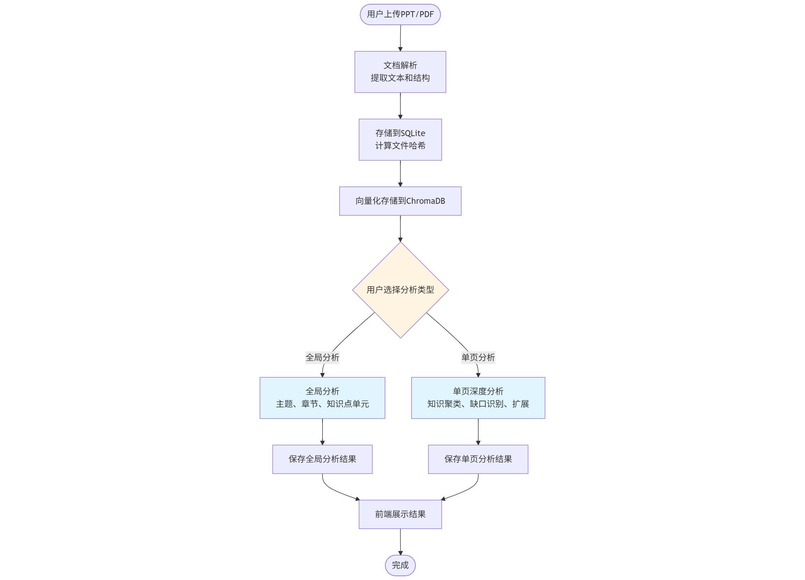
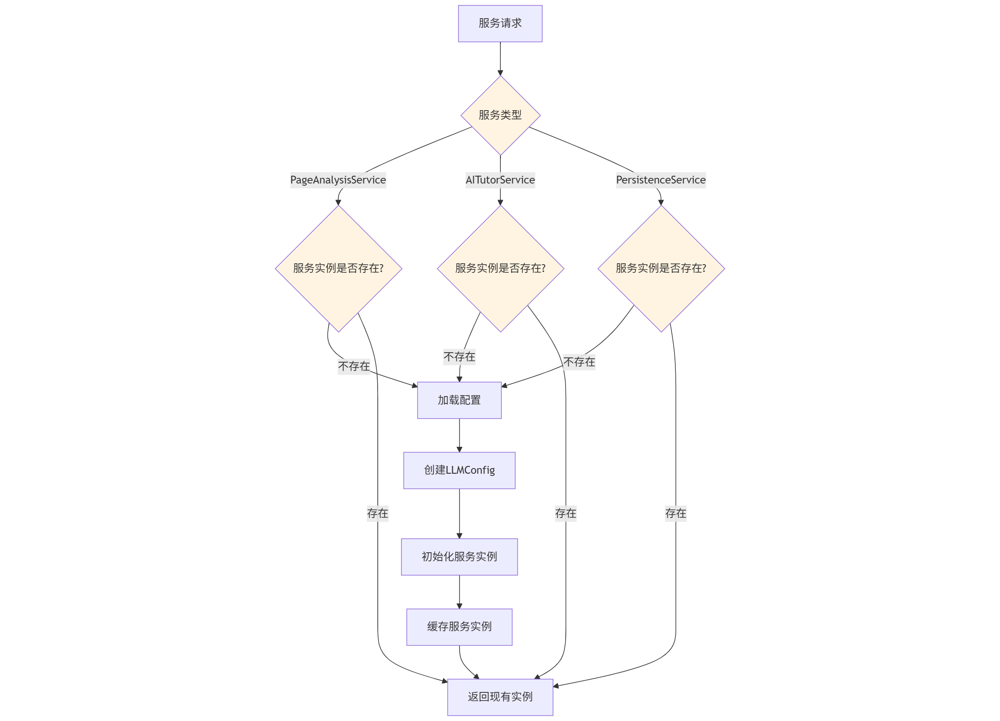

# PPTAS 技术文档

## 2026-01

### GitHub仓库：[PPTAS](https://github.com/AM-SuSh/PPTAS)

---

## 1. 架构设计

### 1.1 系统整体工作流程



### 1.2 系统架构图

（说明：系统通过 Docker Compose 编排多个容器；前端为 Nginx 静态站点容器，后端为 FastAPI 容器；SQLite 用于持久化存储；ChromaDB 用于向量检索；LLM 通过 OpenAI 兼容接口以外部服务方式调用。）


### 1.3 使用到的云原生组件与工程化要点

#### 1) 容器化技术（已使用）

**Docker**:
- 容器运行时环境，用于应用容器化部署
- 后端容器：基于 `python:3.9-slim` 镜像
- 前端构建容器：基于 `node:18-alpine` 镜像
- 前端生产容器：基于 `nginx:alpine` 镜像

**Docker Compose**:
- 多容器编排工具，见 `docker-compose.yml`
- 服务定义：
  - `frontend`：构建后由 Nginx 提供静态资源服务（对外 `80:80`）
  - `backend`：FastAPI 应用（对外 `8000:8000`）
- 容器网络：使用 `bridge` 驱动创建 `pptas-network` 网络
- 容器重启策略：`restart: unless-stopped`

**Docker Volume**:
- 数据持久化：`backend` 目录以 bind mount 形式挂载到容器
- 向量数据库持久化：ChromaDB 数据存储在 `ppt_vector_db` 目录
- SQLite 数据库持久化：`pptas_cache.sqlite3` 文件存储在宿主机

**Docker Network**:
- 容器间通信：通过自定义网络 `pptas-network` 实现前后端通信
- 网络隔离：前后端容器在同一网络中，可相互访问

#### 2) Web 框架与服务器（已使用）

**FastAPI**:
- Python 异步 Web 框架，用于构建 RESTful API
- 位置：`backend/src/app.py`
- 特性：自动生成 API 文档（Swagger/OpenAPI）、类型验证、异步支持

**Uvicorn**:
- ASGI 服务器，用于运行 FastAPI 应用
- 启动命令：`uvicorn main:app --host 0.0.0.0 --port 8000`
- 支持热重载和异步请求处理

**Nginx**:
- Web 服务器，用于提供前端静态资源服务
- 配置位置：`frontend/nginx.conf`
- 功能：反向代理、静态文件服务、负载均衡（可扩展）

#### 3) 前端技术栈（已使用）

**Vue.js 3**:
- 前端框架，用于构建用户界面
- 位置：`frontend/src/`
- 特性：响应式数据绑定、组件化开发、组合式 API

**Vite**:
- 前端构建工具，用于快速开发和构建
- 配置：`frontend/vite.config.js`
- 特性：热模块替换（HMR）、快速构建、开发服务器

**Node.js**:
- JavaScript 运行时，用于前端构建环境
- 版本：Node.js 18（Alpine 镜像）
- 用途：npm 包管理、前端依赖安装、构建脚本执行

#### 4) 数据库与存储（已使用）

**SQLite**:
- 轻量级关系型数据库，作为持久化存储组件
- 实现位置：`backend/src/services/persistence_service.py`
- 存储内容：
  - 文档信息（`documents` 表）
  - 全局分析结果（`documents.global_analysis_json` 字段）
  - 单页分析结果（`page_analysis` 表）
- 特性：文件级持久化，无需单独部署数据库服务，支持事务和索引优化

**ChromaDB**:
- 向量数据库，作为语义检索组件（RAG 的检索层）
- 实现位置：`backend/src/services/vector_store_service.py`
- 功能：
  - 文档切片向量化存储
  - 基于语义的相似度搜索
  - 支持自定义 Embedding 模型（默认：`BAAI/bge-large-zh-v1.5`）
- 数据持久化：由 Docker volume 或本地目录 `ppt_vector_db` 提供

#### 5) AI/ML 框架（已使用）

**LangChain**:
- LLM 应用开发框架，用于构建 AI Agent 应用
- 核心组件：
  - `langchain-core`：核心抽象和接口
  - `langchain-openai`：OpenAI 兼容接口
  - `langchain-community`：社区工具和集成
  - `langchain-chroma`：ChromaDB 向量存储集成

**LangGraph**:
- 工作流编排框架，用于构建多 Agent 协作流程
- 实现位置：`backend/src/services/ppt_expansion_service.py`
- 特性：有向无环图（DAG）结构、状态管理、条件边、并行执行

**OpenAI 兼容接口**:
- 通过 `ChatOpenAI` 和 `OpenAIEmbeddings` 接入 LLM 服务
- 配置位置：`backend/config.json`
- 支持：OpenAI API、SiliconFlow 等兼容 OpenAI 接口的服务

#### 6) 通信协议（已使用）

**REST API**:
- HTTP RESTful 接口，用于前后端通信
- 实现：FastAPI 自动生成 RESTful 端点
- 特性：标准 HTTP 方法（GET、POST、DELETE）、JSON 数据格式、CORS 支持

**Server-Sent Events (SSE)**:
- 服务器推送事件协议，用于流式传输分析结果
- 实现位置：`backend/src/app.py` - `/api/v1/analyze-page-stream`
- 特性：实时推送、单向通信、自动重连、提升用户体验

**HTTP/HTTPS**:
- 应用层协议，用于所有网络通信
- 前端访问：HTTP（端口 80）
- 后端 API：HTTP（端口 8000）
- 可扩展：支持 HTTPS 配置（生产环境推荐）

#### 7) Python 运行时（已使用）

**Python 3.9**:
- 编程语言运行时，用于后端服务
- 容器镜像：`python:3.9-slim`
- 特性：异步编程支持（asyncio）、类型提示、标准库丰富

#### 8) 数据验证与处理（已使用）

**Pydantic**:
- 数据验证库，用于 API 请求/响应模型验证
- 用途：数据模型定义、类型验证、自动文档生成

**aiohttp**:
- 异步 HTTP 客户端/服务器库
- 用途：异步 HTTP 请求、外部 API 调用

**requests**:
- 同步 HTTP 客户端库
- 用途：同步 HTTP 请求、外部知识源检索

#### 9) 文档处理库（已使用）

**python-pptx**:
- PPTX 文件解析库
- 功能：提取幻灯片文本、结构、标题、内容点

**PyMuPDF (fitz)**:
- PDF 文件处理库
- 功能：提取 PDF 文本、图片、元数据

#### 10) 外部知识源集成（已使用）

**Wikipedia API**:
- 维基百科搜索接口，用于外部知识检索

**Arxiv API**:
- 学术论文搜索接口，用于学术资料检索

**Baidu Baike**:
- 百度百科搜索，用于中文知识检索

**DuckDuckGo Search**:
- 搜索引擎 API，用于通用网络搜索


### 1.4 LLM Agent 工具链（实现形态）

系统的智能能力通过后端的多个 Agent/模块协作完成，核心工具链如下：

- LLM/Embedding 接入：使用 LangChain OpenAI SDK 兼容接口（`ChatOpenAI`、`OpenAIEmbeddings`），通过 `LLMConfig` 配置指向 OpenAI 兼容 API（见 `backend/src/agents/base.py`）。
- 结构化输出：关键链路使用 JSON 解析器提取结构化数据，减少解析歧义（见多个 Agent 实现）。
- 重试与降级：
  - LLM 调用实现重试机制（`max_retries=3`）。
  - JSON 提取失败或字段缺失时，采取降级策略保证接口可用（如全局结构解析、知识聚类解析）。
- 幻觉风险控制与校验：
  - 一致性校验 Agent（`ConsistencyCheckAgent`）校验扩展内容与原始内容的一致性。
  - 禁止编造：不能提及 PPT 未涉及的新概念。
  - 有据可查：所有陈述必须来自 PPT 或参考资料。
- 文档解析：
  - PPTX：`python-pptx` 解析结构与文本。
  - PDF：`PyMuPDF (fitz)` 提取文本与图片。
  - 支持本地文件上传和 URL 下载。

---

## 2. 核心功能模块

### 2.1 文档解析与上传

**实现位置**: `backend/src/services/ppt_parser_service.py`

**功能**:
- 支持 PPTX 和 PDF 格式文档解析
- 提取幻灯片标题、内容、要点列表
- 支持本地文件上传和 URL 下载
- 自动计算文件哈希值用于去重

**API 端点**: `POST /api/v1/expand-ppt`

**数据流**:
```
文件上传/URL下载
  ↓
文档解析（python-pptx / PyMuPDF）
  ↓
提取文本和结构
  ↓
存储到 SQLite（documents 表）
  ↓
向量化并存储到 ChromaDB
  ↓
返回 doc_id 和 slides 数据
```


### 2.2 全局分析功能

**实现位置**: `backend/src/agents/base.py` - `GlobalStructureAgent`, `KnowledgeClusteringAgent`

**功能**:
- 分析整个文档的主题、章节结构和知识逻辑流程
- 识别跨页面的知识点单元
- 为单页分析提供全局上下文

**API 端点**: `POST /api/v1/analyze-document-global`

#### 2.2.1 GlobalStructureAgent 实现细节

**核心逻辑**:

1. 接收所有页面的文本内容
2. 如果页数过多（>20页），进行文本摘要以减少 token 消耗
   - 取前5页、后5页，中间每5页取1页
   - 每页限制为 500-800 字符
3. 使用 LLM 提取主题、章节和知识流程
4. 解析 JSON 格式的输出，处理可能的 markdown 代码块

**技术要点**:
- 温度参数设置为 0，确保输出稳定性
- 对长文档进行智能摘要，平衡信息完整性和 token 消耗
- 输入限制: 超过 20 页时，每页 200-500 字摘要
- JSON 解析失败时，从第一页标题推断主题作为降级策略

**输出验证**:
- 验证 `main_topic` 不能为空或"未知"
- 如果解析失败，尝试从第一页标题推断主题
- 确保至少识别1-3个主要章节

#### 2.2.2 KnowledgeClusteringAgent 实现细节

**核心逻辑**:

1. 基于全局结构信息，识别跨页面的知识点单元
2. 每个知识点单元包含：单元ID、标题、涉及页面、核心概念
3. 确保知识点单元的完整性和教学闭环

**输出格式**:
```python
[
    KnowledgeUnit(
        unit_id="unit_1",
        title="知识点单元标题",
        pages=[1, 2, 3],
        core_concepts=["概念1", "概念2"]
    )
]
```

**文本处理优化**:
- 如果页数 > 15，使用摘要：每页取前 500 字符
- 页数不多时，传递完整内容，每页限制 1000 字符

**验证和过滤**:
- 确保 `concept` 字段不为空
- 验证 `pages` 字段是有效的数字数组
- 最多保留 15 个知识点单元

**Agent 流程**:
```
GlobalStructureAgent
  - 输入: 所有页面文本
  - 输出: 全局结构（主题、章节、知识流程）
  ↓
KnowledgeClusteringAgent
  - 输入: 全局结构 + 所有页面文本
  - 输出: 知识点单元列表
  ↓
构建全局分析结果
  ↓
保存到 SQLite（documents.global_analysis_json）
```

**Agent 流程图**:

  

**缓存机制**:
- 全局分析结果存储在数据库的 `documents.global_analysis_json` 字段
- 如果文档已有全局分析结果，直接返回缓存（除非 `force=true`）
- 使用 `force=true` 可以强制重新分析

**数据流**:
```
文档上传
  ↓
解析slides
  ↓
存储到数据库（documents表）
  ↓
提取所有页面文本
  ↓
GlobalStructureAgent → global_outline
  ↓
KnowledgeClusteringAgent → knowledge_units
  ↓
构建全局分析结果
  ↓
保存到 documents.global_analysis_json
  ↓
返回结果
```


### 2.3 单页深度分析功能

**实现位置**: `backend/src/services/page_analysis_service.py` - `PageDeepAnalysisService`

**功能**:
- 知识聚类：识别页面中难以理解的概念
- 理解笔记生成：生成结构化学习笔记
- 知识缺口识别：识别学生理解障碍点
- 知识扩展：为缺口生成补充说明
- 外部检索：从网络检索参考资料
- 一致性校验：校验扩展内容的准确性
- 内容整理：整理为最终格式

**API 端点**:
- `POST /api/v1/analyze-page`（非流式）
- `POST /api/v1/analyze-page-stream`（流式，推荐）

#### 2.3.1 PageKnowledgeClusterer 实现细节

**核心逻辑**:

1. 支持基于全局上下文的增强分析
2. 识别概念、评估难度级别、说明困难原因
3. 限制最多 10 个概念，避免信息过载

**配置参数**:
- 温度: 0.3（有创意但相对稳定）
- 最多 10 个概念
- 难度分级: 1（简单）到 5（很难）

**全局上下文支持**:

当提供全局分析结果时，Agent 会：
- 参考全局知识点单元
- 考虑概念在整个文档知识体系中的位置
- 提供更准确的难度评估

**输出格式**:
```python
[
    {
        "concept": "概念名称",
        "difficulty_level": 3,              # 1-5
        "why_difficult": "为什么难理解",
        "related_concepts": ["相关概念"],
        "global_context": "在全局知识框架中的位置"
    }
]
```

#### 2.3.2 StructureUnderstandingAgent 实现细节

**核心逻辑**:

1. 两个 LLM 调用：
   - 第一个：生成 Markdown 格式的学习笔记
   - 第二个：提取页面结构信息
2. 笔记格式适合快速复习
3. 结构化提取便于后续处理

**配置参数**:
- 温度: 0.5（平衡创意和准确性）
- 输入限制: 1000 字内容 + 800 字全局上下文
- 笔记长度限制: 300 字

**输出格式**:
- `understanding_notes`: Markdown 格式的学习笔记
- `page_structure`: 包含页面ID、标题、核心概念、关键要点等

#### 2.3.3 GapIdentificationAgent 实现细节

**核心逻辑**:

1. 基于页面内容和已识别的难点概念
2. 识别四种类型的知识缺口：
   - 直观解释：缺少通俗易懂的解释
   - 应用示例：缺少实际应用场景
   - 背景知识：缺少前置知识
   - 公式推导：缺少公式推导过程
3. 为每个缺口分配优先级（1-5）

**配置参数**:
- 温度: 0.2（确定性，聚焦实际问题）
- 最多 5 个缺口，避免过度分析
- 优先级: 1（可选）到 5（必须）

**全局上下文支持**:

当提供全局分析结果时，Agent 会：
- 考虑概念在整个文档中的位置和关系
- 识别跨页面的知识依赖关系

**输出格式**:
```python
[
    KnowledgeGap(
        concept="需要补充的概念",
        gap_types=["直观解释", "应用示例"],
        priority=4
    )
]
```

#### 2.3.4 KnowledgeExpansionAgent 实现细节

**核心逻辑**:

1. 针对每个知识缺口，生成相应的补充说明
2. 根据缺口类型选择不同的生成策略：
   - 直观解释：提供通俗易懂的解释
   - 应用示例：提供实际应用场景
   - 背景知识：补充前置知识
   - 公式推导：提供详细的推导过程
3. 引用已检索的外部文档作为支撑
4. 按优先级排序，只处理前 3 个缺口
5. 严格控制长度（150 字内），确保简洁

**配置参数**:
- 温度: 0.6（更多创意用于举例）
- 最多处理 3 个缺口
- 输出限制: 150 字 + 300 字最终长度
- 输入: 500 字内容

**输出格式**:
```python
[
    ExpandedContent(
        concept="概念",
        gap_type="直观解释",
        content="补充说明内容",
        sources=["来源1", "来源2"]
    )
]
```

#### 2.3.5 RetrievalAgent 实现细节

**核心逻辑**:

1. 基于知识缺口中的概念，构建检索查询
2. 从多个知识源检索：
   - Wikipedia（维基百科）
   - Arxiv（学术论文）
   - Baidu Baike（百度百科）
   - 本地向量数据库
3. 合并和去重检索结果
4. 限制结果数量，避免信息过载

**检索策略**:

1. **智能源检测**: 初始化时测试外部源连通性
2. **优先本地 RAG**: 先从向量数据库检索
3. **外部检索**: 仅当本地结果不足且源可用时查询
4. **早期退出**: 所有源都不可用时立即返回
5. **结果过滤**: 去除占位符文档，仅保留有有效 URL 的结果


**实现代码**:
```python
def run(self, state: GraphState) -> GraphState:
    # 0. 首先检查外部源可用性（在AI答复之前）
    self._test_sources()
    available_external = any(s["available"] for s in self.sources.values())
    
    if not available_external:
        print("警告: 所有外部源均不可用，将仅使用本地RAG")
        # 继续执行本地 RAG 检索
```

**配置参数**:
- 温度: 0（确定性检索）
- 最多 5 条检索结果
- 只为高优先级缺口（priority ≥ 4）检索
- 合并查询以减少检索次数

#### 2.3.6 ConsistencyCheckAgent 实现细节

**核心逻辑**:

1. 对比扩展内容与原始 PPT 内容
2. 检查是否存在：
   - 信息矛盾
   - 过度延伸
   - 偏离主题
3. 生成校验结果和建议

**校验规则**:

1. **禁止编造**: 不能提及 PPT 未涉及的新概念
2. **有据可查**: 所有陈述必须来自 PPT 或参考资料
3. **标记推测**: 不确定的内容标记为"推测"
4. **发现矛盾**: 与 PPT 或参考资料矛盾时标记为修正

**配置参数**:
- 温度: 0（严格检查，无创意）
- 输入限制: PPT 600 字 + 参考 3 条

**输出格式**:
```python
CheckResult(
    status="pass" | "revise",
    issues=["问题1", "问题2"],
    suggestions=["建议1", "建议2"]
)
```

**修订机制**:

如果校验失败（status="revise"），且修订次数未达到上限，系统会：
1. 增加修订计数
2. 重新执行知识扩展
3. 再次进行一致性校验

**修订机制流程图**:

  

#### 2.3.7 StructuredOrganizationAgent 实现细节

**核心逻辑**:

1. 整合所有分析结果
2. 生成结构化的最终学习笔记
3. 确保内容不偏离源文本
4. 优化 Markdown 格式
5. 去重和去冗余
6. 生成适合读者快速查阅的版本

**笔记格式**:
- 标题明确
- 核心概念优先
- 避免重复原文
- 适合快速复习
- 严格控制长度（300 字内）

**配置参数**:
- 温度: 0.5（平衡）
- 输出限制: 300 字内
- 输入: 500 字内容 + 补充说明

**Agent 流程**:
```
PageKnowledgeClusterer
  - 输入: 当前页面文本 + 全局上下文（可选）
  - 输出: 难点概念列表
  ↓
StructureUnderstandingAgent
  - 输入: 页面文本 + 全局上下文
  - 输出: 结构化学习笔记 + 页面结构
  ↓
GapIdentificationAgent
  - 输入: 页面内容 + 已识别难点
  - 输出: 知识缺口列表
  ↓
KnowledgeExpansionAgent
  - 输入: 知识缺口列表
  - 输出: 扩展内容列表
  ↓
RetrievalAgent（并行）
  - 输入: 知识缺口 + 核心概念
  - 输出: 参考资料列表
  ↓
ConsistencyCheckAgent
  - 输入: 扩展内容 + 原始内容 + 参考资料
  - 输出: 校验结果
  ├─→ status="revise" 且 revision_count < max_revisions：重新扩展
  └─→ status="pass"：继续
  ↓
StructuredOrganizationAgent
  - 输入: 所有分析结果
  - 输出: 最终整理的学习笔记
```

**Agent 流程图**:

  

**流式分析实现**:

流式分析使用 SSE 协议实时返回各阶段的分析结果。

**流式分析流程图**:

  

**实现方式**:
```python
async def event_generator():
    # 步骤1: 知识聚类
    yield f"data: {json.dumps({'stage': 'clustering', 'data': knowledge_clusters, 'message': '...'})}\n\n"
    
    # 步骤2: 学习笔记
    yield f"data: {json.dumps({'stage': 'understanding', 'data': understanding_notes, 'message': '...'})}\n\n"
    
    # 步骤3: 知识缺口
    yield f"data: {json.dumps({'stage': 'gaps', 'data': knowledge_gaps, 'message': '...'})}\n\n"
    
    # ... 其他步骤
    
    # 完成
    yield f"data: {json.dumps({'stage': 'complete', 'data': final_result, 'message': '分析完成'})}\n\n"

return StreamingResponse(event_generator(), media_type="text/event-stream")
```

**事件阶段**:
- `clustering`: 知识聚类结果
- `understanding`: 理解笔记
- `gaps`: 知识缺口
- `expansion`: 扩展内容
- `retrieval`: 参考资料
- `complete`: 分析完成

**全局上下文支持**:

单页分析可以基于全局分析结果进行，提供更准确的上下文：

```python
# 获取全局分析结果（如果有）
global_analysis = None
if request.doc_id:
    doc = persistence.get_document_by_id(request.doc_id)
    if doc and doc.get("global_analysis"):
        global_analysis = doc["global_analysis"]
```

各个 Agent 会根据是否有全局上下文，使用不同的 prompt：
- **有全局上下文**: 参考全局知识点框架，提供更准确的分析
- **无全局上下文**: 仅基于当前页面内容进行分析

**缓存机制**:
- 单页分析结果存储在 `page_analysis` 表中
- 如果页面已有分析结果，直接返回缓存（除非 `force=true`）
- 流式分析也会检查缓存，如果有缓存则直接回放

**缓存检查**:
```python
# 如果 force=False 且有缓存，则直接返回
if request.doc_id and not request.force:
    cached = persistence.get_page_analysis(request.doc_id, request.page_id)
    if cached:
        return {"success": True, "cached": True, "data": cached}
```

**注意事项**:
- 全局分析是异步的：前端在后台调用，不阻塞UI。如果全局分析未完成，页面分析仍可进行（但效果较差）。
- 向后兼容：如果没有全局分析结果，页面分析仍可进行。各个 Agent 会检查是否有全局上下文，没有时使用原始逻辑。
- 性能考虑：全局分析可能耗时较长（取决于文档页数），建议在后台异步执行，不阻塞用户操作。

### 2.4 向量存储与语义搜索

**实现位置**: `backend/src/services/vector_store_service.py` - `VectorStoreService`

**功能**:
- 文档切片向量化存储
- 基于语义的相似度搜索
- 支持按文件名搜索
- 统计信息查询

**API 端点**:
- `POST /api/v1/search-semantic`：语义搜索
- `GET /api/v1/vector-store/stats`：统计信息
- `GET /api/v1/vector-store/file/{file_name}`：按文件名搜索
- `DELETE /api/v1/vector-store/file/{file_name}`：删除文件向量

**技术要点**:
- 使用 ChromaDB 作为向量数据库
- 支持自定义 Embedding 模型（默认：`BAAI/bge-large-zh-v1.5`）
- 文本分块策略：保持幻灯片完整性，每个幻灯片作为一个完整文档存储


### 2.5 外部知识源检索

**实现位置**: `backend/src/services/mcp_tools.py` - `MCPRouter`

**功能**:
- 支持多个外部知识源：Wikipedia、Arxiv、Baidu Baike
- 智能源检测：初始化时测试外部源连通性
- 优先本地 RAG：先从向量数据库检索
- 早期退出：所有源都不可用时立即跳过检索

**API 端点**:
- `POST /api/v1/search-references`：参考文献搜索
- `POST /api/v1/search-external`：外部资源搜索
- `POST /api/v1/search-by-concepts`：按概念搜索


**知识源说明**:
- Arxiv（学术论文，最优先）
- Wikipedia（百科知识，中英文）
- Baidu Baike（百度百科，中文优先）
- 本地向量数据库（ChromaDB）

**连接检查优化**:
- 在 AI 答复之前进行连接检查
- 如果所有源不可用，立即跳过检索，避免浪费时间

### 2.6 AI 助教对话功能

**实现位置**: `backend/src/services/ai_tutor_service.py` - `AITutorService`

**功能**:
- 基于页面上下文的智能对话
- 支持多页面独立对话历史
- 聚焦学生理解障碍点
- 提供个性化学习指导

**API 端点**:
- `POST /api/v1/chat`：发送消息
- `POST /api/v1/tutor/set-context`：设置页面上下文
- `POST /api/v1/tutor/set-context-bulk`：批量设置上下文
- `GET /api/v1/tutor/conversation`：获取对话历史
- `DELETE /api/v1/tutor/conversation/{page_id}`：清除对话历史
- `GET /api/v1/tutor/debug/{page_id}`：调试上下文


**上下文内容**:
- 每个页面维护独立的对话历史
- 上下文包含：页面标题、原始内容、知识聚类、理解笔记、知识缺口、补充说明

### 2.7 思维导图生成

**实现位置**: `backend/src/services/mindmap_service.py` - `MindmapService`

**功能**:
- 从全局分析结果生成思维导图

**API 端点**:
- `POST /api/v1/mindmap`：单页思维导图
- `POST /api/v1/mindmap/from-slides`：整个 PPT 思维导图
- `POST /api/v1/mindmap/from-global-analysis`：基于全局分析的思维导图

**输出格式**:
```json
{
  "root": {
    "id": "root",
    "label": "标题",
    "children": [...],
    "meta": {...}
  }
}
```

### 2.8 分析结果导出

**实现位置**: `backend/src/services/export_service.py` - `ExportService`

**功能**:
- 导出完整分析内容为 Markdown 格式

**API 端点**: `POST /api/v1/export`

**导出内容**:
- 文档信息
- 全局分析结果（主题、章节、知识点单元）
- 页面分析结果（学习笔记、知识缺口、补充说明、参考资料）


### 2.9 关键词提取

**实现位置**: `backend/src/services/keyword_extraction_service.py` - `KeywordExtractionService`

**功能**:
- 从页面内容提取关键词
- 支持指定关键词数量（1-10个）
- 基于 LLM 的智能提取

**API 端点**: `POST /api/v1/extract-keywords`

**关键词提取流程**:


### 2.10 数据持久化

**实现位置**: `backend/src/services/persistence_service.py` - `PersistenceService`

**功能**:
- 文档信息存储（documents 表）
- 全局分析结果存储
- 单页分析结果存储（page_analysis 表）
- 文件哈希去重
- 线程安全的数据库操作

#### 2.10.1 数据库设计

**数据库选择**:

选择 SQLite 作为持久化存储，原因：
- 轻量级，无需单独部署数据库服务
- 文件型数据库，易于备份和迁移
- 支持 JSON 字段存储复杂数据结构
- 性能满足中小规模应用需求

**documents 表结构**:

```sql
CREATE TABLE documents (
    doc_id TEXT PRIMARY KEY,              -- 文档唯一标识
    file_name TEXT,                       -- 文件名
    file_type TEXT,                       -- 文件类型
    file_hash TEXT UNIQUE,                -- 文件哈希值（SHA256）
    slides_json TEXT,                     -- slides 数据（JSON）
    global_analysis_json TEXT,            -- 全局分析结果（JSON）
    created_at TEXT,                      -- 创建时间
    updated_at TEXT                       -- 更新时间
)
```

**设计要点**:
- `doc_id`: 使用 UUID 作为主键，确保唯一性
- `file_hash`: 使用 SHA256 哈希值，用于文件去重
- `slides_json`: 存储解析后的 slides 数据，使用 JSON 格式
- `global_analysis_json`: 存储全局分析结果，使用 JSON 格式
- 索引: 在 `file_hash` 上创建索引，加快查询速度

**page_analysis 表结构**:

```sql
CREATE TABLE page_analysis (
    doc_id TEXT NOT NULL,                 -- 文档ID（外键）
    page_id INTEGER NOT NULL,             -- 页面编号
    analysis_json TEXT NOT NULL,          -- 分析结果（JSON）
    created_at TEXT,                      -- 创建时间
    updated_at TEXT,                      -- 更新时间
    PRIMARY KEY (doc_id, page_id),
    FOREIGN KEY (doc_id) REFERENCES documents(doc_id) ON DELETE CASCADE
)
```

**设计要点**:
- 复合主键: `(doc_id, page_id)` 确保每个文档的每个页面只有一条分析记录
- 外键约束: 关联到 `documents` 表，删除文档时级联删除页面分析
- `analysis_json`: 存储单页分析结果，使用 JSON 格式
- 索引: 在 `doc_id` 上创建索引，加快查询速度

#### 2.10.2 数据操作实现

**数据操作流程图**:


**服务类设计**:

**类名**: `PersistenceService`

**位置**: `backend/src/services/persistence_service.py`

**核心方法**:
- `_init_db()`: 初始化数据库和表结构
- `upsert_document()`: 插入或更新文档
- `update_global_analysis()`: 更新全局分析结果
- `get_document_by_id()`: 通过 doc_id 查询文档
- `get_document_by_hash()`: 通过 file_hash 查询文档
- `upsert_page_analysis()`: 插入或更新单页分析
- `get_page_analysis()`: 查询单页分析
- `list_page_analyses()`: 查询文档所有页面分析

**线程安全**:

使用 `threading.Lock` 确保数据库操作的线程安全：

```python
def __init__(self, db_path: str):
    self._lock = threading.Lock()
    # ...

def upsert_document(self, ...):
    with self._lock:
        with self._connect() as conn:
            # 数据库操作
            conn.commit()
```

**JSON 序列化**:

使用 `json.dumps()` 和 `json.loads()` 进行 JSON 序列化和反序列化：

```python
# 存储
slides_json = json.dumps(slides, ensure_ascii=False)
conn.execute("INSERT INTO documents (slides_json) VALUES (?)", (slides_json,))

# 读取
doc = dict(row)
doc["slides"] = json.loads(doc["slides_json"]) if doc.get("slides_json") else []
```

#### 2.10.3 数据迁移

**自动迁移**:

系统会自动检测数据库表结构，如果缺少 `global_analysis_json` 字段，会自动添加：

```python
def _init_db(self):
    # 创建表
    conn.execute("CREATE TABLE IF NOT EXISTS documents (...)")
    
    # 检查是否需要迁移
    cursor = conn.execute("PRAGMA table_info(documents)")
    columns = [row[1] for row in cursor.fetchall()]
    if 'global_analysis_json' not in columns:
        conn.execute("ALTER TABLE documents ADD COLUMN global_analysis_json TEXT")
        conn.commit()
```

#### 2.10.4 性能优化

**索引优化**:
- `idx_documents_file_hash`: 基于 `file_hash` 的索引，用于快速查找文档
- `idx_page_analysis_doc_id`: 基于 `doc_id` 的索引，用于快速查找文档的所有页面分析

**连接管理**:

使用上下文管理器确保数据库连接正确关闭：

```python
def _connect(self) -> sqlite3.Connection:
    conn = sqlite3.connect(self.db_path, check_same_thread=False)
    conn.row_factory = sqlite3.Row
    return conn

# 使用
with self._connect() as conn:
    # 数据库操作
    conn.commit()
```

---

## 3. 智能体策略（Prompt 模板 + Agent 设计过程 + 工具链）

### 3.1 Agent 组成与职责映射

后端 Agent 主要位于 `backend/src/agents/base.py`：

- `GlobalStructureAgent`（全局结构解析）：分析整个文档的主题、章节结构和知识逻辑流程
- `KnowledgeClusteringAgent`（全局知识点聚类）：将文档内容聚类为知识点单元
- `PageKnowledgeClusterer`（单页知识聚类）：识别单页中难以理解的概念
- `StructureUnderstandingAgent`（结构理解与笔记生成）：生成结构化学习笔记
- `GapIdentificationAgent`（知识缺口识别）：识别学生理解障碍点
- `KnowledgeExpansionAgent`（知识扩展）：为识别的知识缺口生成补充说明
- `RetrievalAgent`（外部检索增强）：从外部知识源检索参考资料
- `ConsistencyCheckAgent`（一致性校验）：校验扩展内容与原始内容的一致性
- `StructuredOrganizationAgent`（内容整理）：将分析结果整理为最终格式

### 3.2 Prompt 设计过程（以"约束优先、结构化输出、可审计"为原则）


本项目的 Prompt 设计遵循以下工程化流程：

1) 先定义输出契约（JSON 格式），要求"仅输出 JSON"，并在解析时处理可能的 markdown 代码块。

2) 对关键任务加入约束与护栏：
   - 全局结构解析要求 `main_topic` 必须填写，不能为空或"未知"
   - 知识缺口识别最多 5 个缺口，避免过度分析
   - 知识扩展最多处理 3 个高优先级缺口
   - 一致性校验禁止编造信息，所有陈述必须来自 PPT 或参考资料

3) 增加可观测的质量信号：通过日志输出关键信息，使系统能提示执行状态。

4) 对不可控输出提供降级策略：JSON 解析失败时仍能返回基本结构，避免业务链路中断。

### 3.3 关键 Prompt 模板摘录（以仓库代码为准）

以下为仓库内真实 Prompt 的"关键片段摘录"，用于展示策略与约束。

#### 1) 全局结构解析 Prompt（JSON 输出 + 验证）

来源：`backend/src/agents/base.py` 的 `GlobalStructureAgent.run`。

```text
你是一个教育专家，需要分析这份PPT/PDF文档的整体结构和知识框架。

文档内容（共{total_pages}页）:
{ppt_texts}

请仔细分析整个文档，提取以下信息：

1. **主题**：整个文档的核心主题是什么？
2. **章节结构**：文档分为哪些主要章节？每个章节包含哪些页面？
3. **知识逻辑流程**：这些章节之间的知识逻辑关系是什么？

请以JSON格式输出，格式如下：
{
  "main_topic": "文档的核心主题（必须填写，不能为空）",
  "chapters": [
    {
      "title": "章节标题",
      "pages": [页码列表，例如[1,2,3]],
      "key_concepts": ["核心概念1", "核心概念2"]
    }
  ],
  "knowledge_flow": "知识逻辑流程的简要描述（50字内）"
}

重要要求：
- main_topic 必须填写，不能为空或"未知"
- 至少识别1-3个主要章节
- 只返回JSON，不要其他文字说明
```

要点：通过明确要求 `main_topic` 不能为空，并在解析失败时从第一页标题推断，确保输出稳定性。

#### 2) 知识缺口识别 Prompt（缺口类型分类 + 优先级评估 + JSON 输出）

来源：`backend/src/agents/base.py` 的 `GapIdentificationAgent.run`。

```text
你是教学助手,识别学生理解这段内容的障碍点。

文档全局信息（如果有）:
- 主题: {main_topic}
- 知识逻辑流程: {knowledge_flow}
- 全局知识点单元: {knowledge_units}

当前页面内容:
{raw_text}

识别知识缺口时，请考虑：
1. 概念在整个文档知识体系中的位置
2. 跨页面的知识依赖关系
3. 前置知识的缺失情况

识别(JSON数组,最多5个):
[
  {
    "concept": "概念",
    "gap_type": "缺少什么(选一个: 直观解释/应用示例/背景知识/公式推导)",
    "priority": 优先级1-5
  }
]
```

要点：将"上下文约束"上升为显式护栏，考虑全局知识框架，提供更准确的缺口识别。

#### 3) 知识扩展 Prompt（缺口类型策略选择 + JSON 输出）

来源：`backend/src/agents/base.py` 的 `KnowledgeExpansionAgent.run`。

```text
你是一个专业的教学助手，擅长扩充和解释知识点。

知识缺口:
{gap_info}

要求：
1. 提供清晰的原理说明、元知识解释和背景知识
2. 如果涉及公式，给出完整的公式推导
3. 如果适用，提供代码示例（Python优先）
4. 提供相关的延伸主题

请按以下JSON格式返回（仅输出JSON，不要输出额外文字）：
{
  "explanation": "...",
  "formulas": [...],
  "code_examples": [...],
  "related_topics": [...]
}
```

要点：根据缺口类型选择不同的生成策略，严格控制长度（150 字内），确保简洁。

#### 4) 一致性校验 Prompt（禁止编造 + 有据可查 + JSON 输出）

来源：`backend/src/agents/base.py` 的 `ConsistencyCheckAgent.run`。

```text
你是内容校验专家，需要检查扩展内容是否与原始PPT内容一致。

原始PPT内容:
{raw_text}

扩展内容:
{expanded_content}

参考资料:
{retrieved_docs}

校验规则：
1. **禁止编造**: 不能提及 PPT 未涉及的新概念
2. **有据可查**: 所有陈述必须来自 PPT 或参考资料
3. **标记推测**: 不确定的内容标记为"推测"
4. **发现矛盾**: 与 PPT 或参考资料矛盾时标记为修正

输出JSON格式：
{
  "status": "pass" | "revise",
  "issues": ["问题1", "问题2"],
  "suggestions": ["建议1", "建议2"]
}
```

要点：通过明确的校验规则，降低幻觉风险，确保扩展内容的准确性。

#### 5) 单页知识聚类 Prompt（难度评估 + 全局上下文支持）

来源：`backend/src/services/page_analysis_service.py` 的 `PageKnowledgeClusterer.run`。

```text
作为学习专家,基于整个文档的全局分析结果,分析当前页面中学生可能有理解难度的概念。

文档全局信息:
- 主题: {main_topic}
- 知识逻辑流程: {knowledge_flow}
- 全局知识点单元: {knowledge_units}

当前页面内容:
{content}

任务: 结合全局知识框架,识别当前页面中难以理解的概念
要求:
1. 参考全局知识点单元,识别当前页面涉及的核心概念
2. 考虑概念在整个文档知识体系中的位置
3. 识别学生可能不理解的原因
4. 评估难度级别（1-5）
5. 最多识别10个概念
```

要点：支持全局上下文增强，提供更准确的概念识别和难度评估。

#### 6) AI 助教系统 Prompt（聚焦学生理解障碍）

来源：`backend/src/services/ai_tutor_service.py` 的 `AITutorService._build_system_prompt`。

```text
你是一位耐心的 AI 学习助教，帮助学生理解和掌握知识。

【页面标题】: {title}

【原始内容】:
{content}

【学生学习笔记】:
{understanding_notes}

【知识要点分析】:
{concepts_analysis}

【可能的理解障碍】:
{gaps_info}

【补充说明】:
{expanded_content}

【你的教学风格】:
1. 以学生为中心 - 始终考虑学生的理解水平
2. 明确重点 - 突出最重要的概念和易错点
3. 循序渐进 - 从简单到复杂，从具体到抽象
4. 举例说明 - 提供实际例子或类比帮助理解
5. 互动式 - 引导而不是直接给出答案，鼓励思考

【重点关注的概念难点】:
{difficult_concepts}

【禁止】:
- 不编造信息
- 不离开当前页面的范围
- 不过度复杂的数学或技术描述
- 不忽视学生的理解困难
```

要点：聚焦学生理解障碍，提供个性化的学习指导。

### 3.4 关键工具链联动（RAG + 校验 + 兜底）

- RAG 检索层：PPT 解析内容向量化后进入 ChromaDB，用于知识扩充/检索等场景的上下文定位（具体向量库调用在 `VectorStoreService` 中完成）。
- 连接检查优化：`RetrievalAgent` 在 AI 答复之前进行连接检查，如果所有源不可用，立即跳过检索，避免浪费时间。
- 校验层：`ConsistencyCheckAgent` 校验扩展内容与原始内容的一致性，降低幻觉风险。
- 降级策略：JSON 解析失败时，从内容推断基本信息，保证接口可用。

---

## 4. 项目优势（云原生组件合理性、稳定性/扩展性、Prompt 工程与事实准确性）

### 4.1 云原生组件使用的合理性

- 容器化与可复现：前后端统一由 Docker Compose 编排，依赖与运行环境可复现，便于演示与交付。
- 职责拆分清晰：前端只负责展示与交互；后端作为统一业务入口；SQLite/ChromaDB 作为独立数据服务，符合"计算与数据服务分离"的工程实践。

### 4.2 稳定性与可用性设计（强调大模型幻觉风险）

- 幻觉风险显式对抗：
  - 一致性校验 Agent 禁止编造信息，所有陈述必须来自 PPT 或参考资料。
  - 全局结构解析要求 `main_topic` 必须填写，不能为空或"未知"。
- 校验与可审计：
  - 一致性校验输出 `status/issues/suggestions`，让系统能提示"本次输出可能存在风险点"。
- 重试与降级：
  - LLM 调用失败具备重试（`max_retries=3`）。
  - JSON 解析失败时降级返回，保证 API 可用。
- 连接检查优化：外部检索在 AI 答复之前进行连接检查，所有源不可用时立即跳过，避免不必要的等待。

### 4.3 扩展性与演进空间（基于现有实现可自然扩展）

- 配置开关与可插拔：LLM 配置、检索配置、扩展配置等均集中在 `config.json` 中，便于按场景裁剪。
- Agent 可扩展：`backend/src/agents/base.py` 以独立 Agent 类封装，可新增更多 Agent（如学习路径规划/知识图谱生成）而不影响现有链路。
- 部署可演进：当前为 Docker Compose；若后续需要弹性伸缩，可在不改业务逻辑的前提下演进至 K8S（仓库当前未包含 K8S 配置，故此处仅为演进方向说明）。

### 4.4 Prompt 工程严谨性与推理链路表达

- 结构化输出优先：多个链路要求"仅输出 JSON"，并在解析时处理可能的 markdown 代码块，减少后处理不确定性。
- 全局上下文支持：单页分析可以基于全局分析结果，提供更准确的上下文，提升分析质量。
- CoT 使用方式克制：知识扩展 Prompt 中存在"思考步骤"引导，但输出严格约束为 JSON，避免前端/后端解析不稳定。

---

## 5. AI Agent LLM 流水线设计

### 5.1 流水线架构

AI Agent LLM 流水线基于 LangGraph 框架实现，采用有向无环图（DAG）结构组织多个 Agent 的协作流程。

#### 5.1.1 流水线流程图

```
初始状态 (GraphState)
  ↓
[GlobalStructureAgent]
  - 输入: 所有页面文本
  - 输出: 全局结构 (主题、章节、知识流程)
  ↓
[KnowledgeClusteringAgent]
  - 输入: 全局结构 + 所有页面文本
  - 输出: 知识点单元列表
  ↓
[PageKnowledgeClusterer] (单页分析时)
  - 输入: 当前页面文本 + 全局上下文
  - 输出: 难点概念列表
  ↓
[StructureUnderstandingAgent]
  - 输入: 页面文本 + 全局上下文
  - 输出: 结构化学习笔记 + 页面结构
  ↓
[GapIdentificationAgent]
  - 输入: 页面内容 + 已识别难点
  - 输出: 知识缺口列表
  ↓
[KnowledgeExpansionAgent] ──┐
  - 输入: 知识缺口列表        │
  - 输出: 扩展内容列表        │
  ↓                          │
[RetrievalAgent] ────────────┘ (并行)
  - 输入: 知识缺口 + 核心概念
  - 输出: 参考资料列表
  ↓
[ConsistencyCheckAgent]
  - 输入: 扩展内容 + 原始内容 + 参考资料
  - 输出: 校验结果
  ↓
[条件判断: 是否需要修订]
  ├─→ 需要修订 → [KnowledgeExpansionAgent] (重新扩展)
  └─→ 通过 → [StructuredOrganizationAgent]
  ↓
最终状态 (包含所有分析结果)
```

#### 5.1.2 状态管理

系统使用 `GraphState` 类型管理状态，定义在 `backend/src/agents/models.py`：

```python
class GraphState(TypedDict):
    # 全局输入
    ppt_texts: List[str]                    # PPT 文本列表
    global_outline: Dict[str, Any]          # 全局概览
    knowledge_units: List[KnowledgeUnit]   # 知识点单元
    
    # 当前处理单元
    current_unit_id: str                    # 当前单元ID
    current_page_id: int                    # 当前页面ID
    raw_text: str                           # 原始文本
    
    # Agent 输出
    page_structure: Dict[str, Any]          # 页面结构
    knowledge_clusters: List[Dict[str, Any]] # 知识聚类
    understanding_notes: str                # 理解笔记
    knowledge_gaps: List[KnowledgeGap]      # 知识缺口
    expanded_content: List[ExpandedContent] # 扩展内容
    retrieved_docs: List[Document]           # 检索文档
    check_result: CheckResult                # 校验结果
    final_notes: str                         # 最终笔记
    
    # 控制字段
    revision_count: int                      # 修订次数
    max_revisions: int                       # 最大修订次数
    streaming_chunks: List[str]             # 流式输出块
```

### 5.2 流水线执行方式

#### 5.2.1 完整流水线（PPTExpansionService）

使用 `PPTExpansionService` 执行完整的 LangGraph 工作流。

**实现位置**: `backend/src/services/ppt_expansion_service.py`

**工作流构建**:

```python
def _build_graph(self) -> StateGraph:
    workflow = StateGraph(GraphState)
    
    # 添加节点
    workflow.add_node("global_structure", self.global_structure_agent.run)
    workflow.add_node("knowledge_clustering", self.clustering_agent.run)
    workflow.add_node("structure_understanding", self.structure_agent.run)
    workflow.add_node("gap_identification", self.gap_agent.run)
    workflow.add_node("knowledge_expansion", self.expansion_agent.run)
    workflow.add_node("retrieval", self.retrieval_agent.run)
    workflow.add_node("consistency_check", self.check_agent.run)
    workflow.add_node("structured_organization", self.organization_agent.run)
    
    # 定义边
    workflow.set_entry_point("global_structure")
    workflow.add_edge("global_structure", "knowledge_clustering")
    workflow.add_edge("knowledge_clustering", "structure_understanding")
    workflow.add_edge("structure_understanding", "gap_identification")
    workflow.add_edge("gap_identification", "knowledge_expansion")
    workflow.add_edge("gap_identification", "retrieval")  # 并行
    workflow.add_edge("knowledge_expansion", "consistency_check")
    workflow.add_edge("retrieval", "consistency_check")
    
    # 条件边：校验通过 -> 整理，校验失败 -> 重新扩展
    workflow.add_conditional_edges(
        "consistency_check",
        self._should_revise,
        {
            "revise": "knowledge_expansion",
            "pass": "structured_organization"
        }
    )
    
    workflow.add_edge("structured_organization", END)
    
    return workflow.compile()
```


**执行步骤**:

1. 初始化状态
2. 按顺序执行各个 Agent
3. 根据条件边决定是否修订
4. 返回最终状态

#### 5.2.2 单页分析（PageDeepAnalysisService）

使用 `PageDeepAnalysisService` 对单个页面进行分析。

**实现位置**: `backend/src/services/page_analysis_service.py`

**执行流程**:

```python
def analyze_page(self, page_id, title, content, raw_points=None):
    # 初始化状态
    state = {
        "ppt_texts": [content],
        "global_outline": {},
        "knowledge_units": [],
        "current_page_id": page_id,
        "raw_text": content,
        # ... 其他字段
    }
    
    # 步骤1: 知识聚类（基于全局上下文）
    knowledge_clusters = self.clustering_agent.run(
        content,
        global_context=global_analysis  # 可选
    )
    state["knowledge_clusters"] = knowledge_clusters
    
    # 步骤2: 理解笔记
    state = self.understanding_agent.run(state)
    
    # 步骤3: 知识缺口识别
    state = self.gap_agent.run(state)
    
    # 步骤4: 知识扩展
    state = self.expansion_agent.run(state)
    
    # 步骤5: 外部检索
    state = self.retrieval_agent.run(state)
    
    # 步骤6: 一致性校验
    state = self.consistency_agent.run(state)
    
    # 步骤7: 内容整理
    state = self.organization_agent.run(state)
    
    # 构建返回结果
    return DeepAnalysisResult(...)
```

**与完整流水线的区别**:

- 不执行全局结构解析和全局知识点聚类
- 可以基于已有的全局分析结果进行增强分析
- 更适合逐页分析的场景

**全局上下文支持**:

单页分析可以基于全局分析结果进行，提供更准确的上下文：

```python
# 获取全局分析结果（如果有）
global_analysis = None
if request.doc_id:
    doc = persistence.get_document_by_id(request.doc_id)
    if doc and doc.get("global_analysis"):
        global_analysis = doc["global_analysis"]

# 构建state（包含global_outline和knowledge_units）
state = {
    "raw_text": request.content,
    "knowledge_clusters": knowledge_clusters,
    "global_outline": global_analysis or {},
    "knowledge_units": global_analysis.get("knowledge_units", []) if global_analysis else [],
    # ... 其他字段
}
```

各个 Agent 会根据是否有全局上下文，使用不同的 prompt：
- **有全局上下文**: 参考全局知识点框架，提供更准确的分析
- **无全局上下文**: 仅基于当前页面内容进行分析

## 6. 系统集成

### 6.1 API 层集成

#### 6.1.1 FastAPI 应用

**位置**: `backend/src/app.py`

**核心功能**:
- 定义 API 端点
- 处理请求和响应
- 依赖注入服务实例
- CORS 中间件配置

#### 6.1.2 端点组织

- `/api/v1/expand-ppt`: 文档上传和解析
- `/api/v1/analyze-document-global`: 全局分析
- `/api/v1/analyze-page`: 单页分析（非流式）
- `/api/v1/analyze-page-stream`: 单页分析（流式）
- `/api/v1/page-analysis`: 查询单页分析
- `/api/v1/page-analysis/all`: 查询所有页面分析

### 6.2 服务层集成

**服务初始化流程图**:




#### 6.2.1 服务初始化

使用单例模式管理服务实例：

```python
_page_analysis_service = None

def get_page_analysis_service():
    global _page_analysis_service
    if _page_analysis_service is None:
        config = load_config()
        llm_config = LLMConfig(...)
        _page_analysis_service = PageDeepAnalysisService(llm_config)
    return _page_analysis_service
```

## 7. 完整数据流

#### 文档上传与解析流程

```
文件上传/URL下载
  ↓
文档解析（DocumentParserService）
  ↓
提取文本和结构
  ↓
计算文件哈希（SHA256）
  ↓
检查是否已存在（SQLite documents 表）
  ├─→ 已存在：返回缓存的 doc_id
  └─→ 不存在：创建新文档记录
  ↓
向量化并存储到 ChromaDB（VectorStoreService）
  ↓
返回 doc_id 和 slides 数据
```

#### 全局分析流程

```
用户请求全局分析
  ↓
检查缓存（documents.global_analysis_json）
  ├─→ 有缓存且 force=false：直接返回
  └─→ 无缓存或 force=true：执行分析
  ↓
提取所有页面文本
  ↓
GlobalStructureAgent → global_outline
  ↓
KnowledgeClusteringAgent → knowledge_units
  ↓
构建全局分析结果
  ↓
保存到 SQLite（documents.global_analysis_json）
  ↓
返回结果
```


#### 单页分析流程

```
用户请求单页分析
  ↓
检查缓存（page_analysis 表）
  ├─→ 有缓存且 force=false：直接返回
  └─→ 无缓存或 force=true：执行分析
  ↓
加载全局分析结果（如果有）
  ↓
PageKnowledgeClusterer → knowledge_clusters
  ↓
StructureUnderstandingAgent → understanding_notes
  ↓
GapIdentificationAgent → knowledge_gaps
  ↓
KnowledgeExpansionAgent → expanded_content
  ↓
RetrievalAgent（并行）→ retrieved_docs
  ↓
ConsistencyCheckAgent → check_result
  ├─→ status="revise" 且 revision_count < max_revisions：重新扩展
  └─→ status="pass"：继续
  ↓
StructuredOrganizationAgent → final_notes
  ↓
保存到 SQLite（page_analysis 表）
  ↓
返回结果（流式或非流式）
```


---

## 8. API 接口总览

### 6.1 文档相关接口

- `POST /api/v1/expand-ppt`：上传并解析 PPT/PDF 文档
- `GET /api/v1/document/by-name/{file_name}`：按文件名查询文档

### 6.2 分析相关接口

- `POST /api/v1/analyze-document-global`：全局分析
- `POST /api/v1/analyze-page`：单页分析（非流式）
- `POST /api/v1/analyze-page-stream`：单页分析（流式）
- `GET /api/v1/page-analysis`：查询单页分析
- `GET /api/v1/page-analysis/all`：查询所有页面分析

### 6.3 搜索相关接口

- `POST /api/v1/search-semantic`：语义搜索
- `POST /api/v1/search-references`：参考文献搜索
- `POST /api/v1/search-external`：外部资源搜索
- `POST /api/v1/search-by-concepts`：按概念搜索

### 6.4 向量存储相关接口

- `GET /api/v1/vector-store/stats`：统计信息
- `GET /api/v1/vector-store/file/{file_name}`：按文件名搜索
- `DELETE /api/v1/vector-store/file/{file_name}`：删除文件向量

### 6.5 AI 助教相关接口

- `POST /api/v1/chat`：发送消息
- `POST /api/v1/tutor/set-context`：设置页面上下文
- `POST /api/v1/tutor/set-context-bulk`：批量设置上下文
- `GET /api/v1/tutor/conversation`：获取对话历史
- `DELETE /api/v1/tutor/conversation/{page_id}`：清除对话历史
- `GET /api/v1/tutor/debug/{page_id}`：调试上下文

### 6.6 思维导图相关接口

- `POST /api/v1/mindmap`：单页思维导图
- `POST /api/v1/mindmap/from-slides`：整个 PPT 思维导图
- `POST /api/v1/mindmap/from-global-analysis`：基于全局分析的思维导图

### 6.7 导出相关接口

- `POST /api/v1/export`：导出分析结果

### 6.8 其他接口

- `POST /api/v1/extract-keywords`：提取关键词
- `GET /api/v1/health`：健康检查
- `GET /api/v1/health/complete`：完整健康检查
- `GET /api/v1/health/llm`：LLM 健康检查

---

## 9. 配置系统实现

### 7.1 配置管理设计

#### 7.1.1 配置类结构

**位置**: `backend/src/config.py`

**配置类**:
- `LLMConfig`: LLM 配置
- `RetrievalConfig`: 检索配置
- `ExpansionConfig`: 扩展配置
- `StreamingConfig`: 流式配置
- `KnowledgeBaseConfig`: 知识库配置

#### 7.1.2 配置管理器

**类名**: `ConfigManager`

**设计模式**: 单例模式

**功能**:
- 加载配置文件（`config.json`）
- 提供类型安全的配置访问
- 支持环境变量覆盖

### 7.2 配置加载流程

#### 7.2.1 配置文件查找

按优先级查找配置文件：


**优先级顺序**:

1. `backend/config.json`
2. `src/config.json`
3. 当前工作目录的 `config.json`
4. 默认配置（最低优先级）

**实现位置**: `backend/src/app.py` - `load_config()`

```python
def load_config():
    """加载配置文件"""
    config_path = os.path.join(os.path.dirname(__file__), "..", "..", "config.json")
    
    if not os.path.exists(config_path):
        config_path = os.path.join(os.path.dirname(__file__), "..", "config.json")
    
    if os.path.exists(config_path):
        with open(config_path, "r", encoding="utf-8") as f:
            return json.load(f)
    
    # 默认配置
    return {
        "llm": {
            "api_key": os.getenv("api_key", ""),
            "base_url": os.getenv("base_url", "https://api.openai.com/v1"),
            "model": os.getenv("model", "gpt-4")
        },
        # ... 其他默认配置
    }
```

#### 7.2.2 环境变量支持

配置管理器会自动读取环境变量：

- `OPENAI_API_KEY` → `llm.api_key`
- `OPENAI_BASE_URL` → `llm.base_url`
- `OPENAI_MODEL` → `llm.model`

### 7.3 配置文件结构

**位置**: `backend/config.json`

**配置结构**:

```json
{
  "llm": {
    "api_key": "your-api-key",
    "base_url": "https://api.openai.com/v1",
    "model": "gpt-4"
  },
  "retrieval": {
    "preferred_sources": ["arxiv", "wikipedia"],
    "max_results": 3,
    "local_rag_priority": true
  },
  "expansion": {
    "max_revisions": 2,
    "min_gap_priority": 3,
    "temperature": 0.7
  },
  "streaming": {
    "enabled": true,
    "chunk_size": 50
  },
  "knowledge_base": {
    "path": "./knowledge_base",
    "chunk_size": 1000,
    "chunk_overlap": 200
  },
  "vector_store": {
    "path": "./ppt_vector_db",
    "chunk_size": 1000,
    "chunk_overlap": 200,
    "embedding_model": "BAAI/bge-m3"
  }
}
```

**配置项详细说明**:

- `llm.api_key`: LLM API 密钥（必需）
- `llm.base_url`: LLM API 基础 URL（必需）
- `llm.model`: 使用的模型名称（必需）
- `retrieval.preferred_sources`: 优先使用的知识源列表
- `retrieval.max_results`: 每个知识源的最大结果数
- `retrieval.local_rag_priority`: 是否优先使用本地 RAG
- `expansion.max_revisions`: 最大修订次数（一致性校验失败时）
- `expansion.min_gap_priority`: 最小缺口优先级（低于此优先级的缺口会被忽略）
- `expansion.temperature`: LLM 温度参数
- `streaming.enabled`: 是否启用流式输出
- `streaming.chunk_size`: 流式输出的块大小
- `vector_store.path`: 向量数据库路径
- `vector_store.embedding_model`: 嵌入模型名称

### 7.4 配置加载优先级

1. 环境变量（最高优先级）
2. `config.json` 文件
3. 默认值（最低优先级）

### 7.5 配置使用

#### 7.5.1 获取配置

```python
from src.config import get_llm_config, get_retrieval_config

llm_config = get_llm_config()
retrieval_config = get_retrieval_config()
```

#### 7.5.2 配置传递

配置通过依赖注入传递给服务：

```python
def get_page_analysis_service():
    config = load_config()
    llm_config = LLMConfig(
        api_key=config["llm"]["api_key"],
        base_url=config["llm"]["base_url"],
        model=config["llm"]["model"]
    )
    return PageDeepAnalysisService(llm_config)
```

---

## 10. 性能优化

### 8.1 缓存策略

#### 8.1.1 分析结果缓存


**缓存内容**:
- 全局分析结果缓存在 SQLite 数据库（`documents.global_analysis_json`）
- 单页分析结果缓存在 SQLite 数据库（`page_analysis.analysis_json`）
- 避免重复分析，提高响应速度

#### 8.1.2 缓存失效

- 使用 `force=true` 参数强制重新分析
- 删除文档时自动删除相关分析结果（级联删除）

### 8.2 流式输出

#### 8.2.1 实时反馈

使用 SSE 协议实时返回各阶段的分析结果，提升用户体验。

#### 8.2.2 减少等待时间

用户无需等待所有分析完成，可以提前查看部分结果。

### 8.3 文本处理优化

#### 8.3.1 文本摘要

**摘要策略**:
- 全局分析: 取前5页、后5页，中间每5页取1页，每页限制 500 字符
- 知识聚类: 每页取前 500 字符摘要

#### 8.3.2 输入限制


**限制规则**:
- 全局结构解析: 超过 20 页时自动摘要
- 单页分析: 1000-1500 字限制
- 检索查询: 800 字限制

### 8.4 Token 消耗优化

#### 8.4.1 输入截断

- 全局分析: 每页 200-500 字摘要
- 单页分析: 1000-1500 字限制
- 检索查询: 800 字限制

#### 8.4.2 模型温度设置

**温度参数配置图**:

**温度参数说明**:
- 结构化任务: 0（确定性）
- 生成任务: 0.5-0.6（创意平衡）
- 创意任务: 0.3-0.5（相对保守）

#### 8.4.3 并行处理


**并行策略**:
- 知识扩展和外部检索可并行执行
- 多页面分析支持批处理

### 8.5 网络请求优化

#### 8.5.1 源可用性缓存

**优化策略**:
- 初始化时测试一次外部源连通性
- 如果所有源不可用，立即跳过检索
- 不浪费时间在失败的查询上

#### 8.5.2 早期退出策略


**策略说明**:
- 仅为高优先级缺口检索（priority ≥ 4）
- 本地 RAG 足够时跳过外部检索
- 获得足够结果后停止查询

#### 8.5.3 结果过滤


**过滤规则**:
- 去除占位符文档（"未找到..."）
- 仅保留有有效 URL 的结果
- 去重处理

---

## 11. 错误处理

### 9.1 异常处理策略

#### 9.1.1 Agent 级别

每个 Agent 的 `run()` 方法都包含 try-except 块，捕获异常并返回默认值：

```python
try:
    state = self.agent.run(state)
except Exception as e:
    print(f"Agent 执行失败: {e}")
    # 返回默认值，不中断流程
    state["result"] = []
```

**降级策略示例**:

在 `GlobalStructureAgent` 中，如果 JSON 解析失败：
```python
try:
    result = json.loads(content)
except Exception as e:
    print(f"JSON解析失败: {e}")
    # 尝试从内容推断基本信息
    result = {"main_topic": "未知", "chapters": [], "knowledge_flow": ""}
    if ppt_texts and len(ppt_texts) > 0:
        first_page = ppt_texts[0]
        if "标题:" in first_page:
            inferred_topic = first_page.split("标题:")[1].split("\n")[0].strip()
            if inferred_topic:
                result["main_topic"] = inferred_topic
```

#### 9.1.2 API 级别


API 端点使用 FastAPI 的异常处理机制：

```python
try:
    result = service.analyze_page(...)
    return {"success": True, "data": result}
except HTTPException:
    raise
except Exception as e:
    raise HTTPException(status_code=500, detail=f"分析失败: {str(e)}")
```

### 9.2 日志记录

#### 9.2.1 日志级别

- INFO: 正常流程信息
- WARNING: 警告信息（如缓存未命中）
- ERROR: 错误信息（如 Agent 执行失败）

#### 9.2.2 日志内容

- Agent 执行开始和结束
- LLM 调用信息（发送的文本长度、返回的原始内容）
- 缓存命中情况
- 错误堆栈信息

**日志示例**:
```python
print(f"📝 发送给LLM的文本长度: {len(ppt_summary)} 字符")
print(f"📥 LLM返回的原始内容: {response.content[:500]}...")
print(f"✅ 解析成功: 主题={result.get('main_topic', '未知')}, 章节数={len(result.get('chapters', []))}")
print(f"❌ JSON解析失败: {e}")
```

---

## 12. 总结

### 12.1 技术亮点

1. **多 Agent 协作**: 基于 LangGraph 实现复杂的多 Agent 协作流程
2. **全局上下文支持**: 单页分析可以基于全局分析结果，提供更准确的上下文
3. **流式输出**: 使用 SSE 协议实时返回分析结果，提升用户体验
4. **数据持久化**: 使用 SQLite 数据库持久化存储分析结果，支持缓存和查询
5. **配置管理**: 灵活的配置系统，支持配置文件和环境变量
6. **连接检查优化**: 在 AI 答复之前进行连接检查，避免不必要的等待

### 12.2 系统优势

1. **模块化设计**: 各个组件职责清晰，易于维护和扩展
2. **可扩展性**: 易于添加新的 Agent 或知识源
3. **性能优化**: 缓存机制和流式输出提升系统性能
4. **错误处理**: 完善的异常处理和日志记录
5. **向后兼容**: 支持无全局分析结果的单页分析

### 12.3 未来改进方向

1. **分布式部署**: 支持多实例部署，提高并发处理能力
2. **更多知识源**: 集成更多外部知识源，提供更丰富的参考资料
3. **模型微调**: 针对特定领域微调模型，提高分析准确性
4. **用户反馈**: 收集用户反馈，持续优化分析质量
5. **性能监控**: 添加性能监控和指标收集

---

## 附：与本文档相关的关键实现文件索引

- 部署编排：`docker-compose.yml`
- 后端配置：`backend/src/app.py` - `load_config()`
- LLM 配置：`backend/src/agents/base.py` - `LLMConfig`
- PPT 解析：`backend/src/services/ppt_parser_service.py` - `DocumentParserService`
- 全局分析 Agent：`backend/src/agents/base.py` - `GlobalStructureAgent`, `KnowledgeClusteringAgent`
- 单页分析服务：`backend/src/services/page_analysis_service.py` - `PageDeepAnalysisService`
- 知识扩展 Agent：`backend/src/agents/base.py` - `KnowledgeExpansionAgent`
- 知识缺口识别 Agent：`backend/src/agents/base.py` - `GapIdentificationAgent`
- 外部检索 Agent：`backend/src/agents/base.py` - `RetrievalAgent`
- 一致性校验 Agent：`backend/src/agents/base.py` - `ConsistencyCheckAgent`
- 向量存储服务：`backend/src/services/vector_store_service.py` - `VectorStoreService`
- 外部知识源：`backend/src/services/mcp_tools.py` - `MCPRouter`
- AI 助教服务：`backend/src/services/ai_tutor_service.py` - `AITutorService`
- 思维导图服务：`backend/src/services/mindmap_service.py` - `MindmapService`
- 导出服务：`backend/src/services/export_service.py` - `ExportService`
- 持久化服务：`backend/src/services/persistence_service.py` - `PersistenceService`
- 关键词提取服务：`backend/src/services/keyword_extraction_service.py` - `KeywordExtractionService`
- 数据模型：`backend/src/agents/models.py`
- API 端点：`backend/src/app.py`

---
