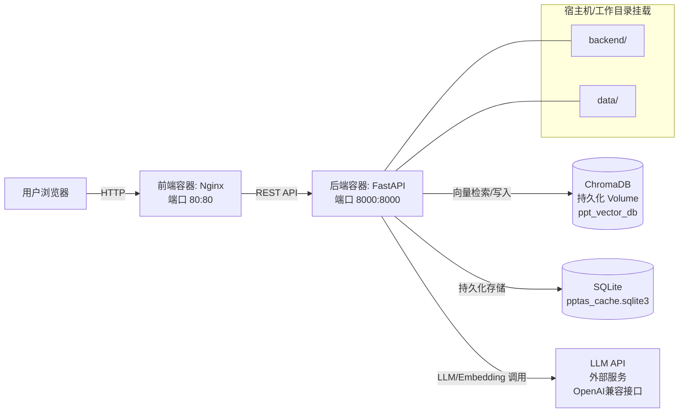

# PPTAS 技术文档

## 2026-01

### GitHub仓库：[PPTAS](https://github.com/your-repo/PPTAS)

---

## 1. 架构设计

### 1.1 系统架构图

（说明：系统通过 Docker Compose 编排多个容器；前端为 Nginx 静态站点容器，后端为 FastAPI 容器；SQLite 用于持久化存储；ChromaDB 用于向量检索；LLM 通过 OpenAI 兼容接口以外部服务方式调用。）



### 1.2 使用到的云原生组件与工程化要点

#### 1) Docker / Docker Compose（已使用）

- 多容器编排：见 `docker-compose.yml`
  - `frontend`：构建后由 Nginx 提供静态资源服务（对外 `80:80`）
  - `backend`：FastAPI 应用（对外 `8000:8000`）
- 健康检查：
  - 后端容器：`HEALTHCHECK` 探测 `http://localhost:8000/health`
- 运行期挂载（backend bind mount）：在 `docker-compose.yml` 中将 `backend` 目录以 volume 形式挂载到容器内部，保证容器运行时读取到真实源码与数据目录。

#### 2) SQLite（已使用）

- 作为持久化存储组件，供后端服务使用（见 `backend/src/services/persistence_service.py`）。
- 存储文档信息、全局分析结果和单页分析结果。
- 支持文件级持久化，无需单独部署数据库服务。

#### 3) 向量数据库 ChromaDB（已使用）

- 作为语义检索组件（RAG 的检索层），供后端服务连接（见 `backend/src/services/vector_store_service.py`）。
- 数据持久化由 Docker volume 或本地目录 `ppt_vector_db` 提供。
- 支持文档切片向量化和语义搜索。


### 1.3 LLM Agent 工具链（实现形态）

系统的智能能力通过后端的多个 Agent/模块协作完成，核心工具链如下：

- LLM/Embedding 接入：使用 LangChain OpenAI SDK 兼容接口（`ChatOpenAI`、`OpenAIEmbeddings`），通过 `LLMConfig` 配置指向 OpenAI 兼容 API（见 `backend/src/agents/base.py`）。
- 结构化输出：关键链路使用 JSON 解析器提取结构化数据，减少解析歧义（见多个 Agent 实现）。
- 重试与降级：
  - LLM 调用实现重试机制（`max_retries=3`）。
  - JSON 提取失败或字段缺失时，采取降级策略保证接口可用（如全局结构解析、知识聚类解析）。
- 幻觉风险控制与校验：
  - 一致性校验 Agent（`ConsistencyCheckAgent`）校验扩展内容与原始内容的一致性。
  - 禁止编造：不能提及 PPT 未涉及的新概念。
  - 有据可查：所有陈述必须来自 PPT 或参考资料。
- 文档解析：
  - PPTX：`python-pptx` 解析结构与文本。
  - PDF：`PyMuPDF (fitz)` 提取文本与图片。
  - 支持本地文件上传和 URL 下载。

---

## 2. 核心功能模块

### 2.1 文档解析与上传

**实现位置**: `backend/src/services/ppt_parser_service.py`

**功能**:
- 支持 PPTX 和 PDF 格式文档解析
- 提取幻灯片标题、内容、要点列表
- 支持本地文件上传和 URL 下载
- 自动计算文件哈希值用于去重

**API 端点**: `POST /api/v1/expand-ppt`

**数据流**:
```
文件上传/URL下载
  ↓
文档解析（python-pptx / PyMuPDF）
  ↓
提取文本和结构
  ↓
存储到 SQLite（documents 表）
  ↓
向量化并存储到 ChromaDB
  ↓
返回 doc_id 和 slides 数据
```

### 2.2 全局分析功能

**实现位置**: `backend/src/agents/base.py` - `GlobalStructureAgent`, `KnowledgeClusteringAgent`

**功能**:
- 分析整个文档的主题、章节结构和知识逻辑流程
- 识别跨页面的知识点单元
- 为单页分析提供全局上下文

**API 端点**: `POST /api/v1/analyze-document-global`

**Agent 流程**:
```
GlobalStructureAgent
  - 输入: 所有页面文本
  - 输出: 全局结构（主题、章节、知识流程）
  ↓
KnowledgeClusteringAgent
  - 输入: 全局结构 + 所有页面文本
  - 输出: 知识点单元列表
  ↓
保存到 SQLite（documents.global_analysis_json）
```

**缓存机制**:
- 全局分析结果存储在数据库的 `documents.global_analysis_json` 字段
- 如果文档已有全局分析结果，直接返回缓存（除非 `force=true`）

### 2.3 单页深度分析功能

**实现位置**: `backend/src/services/page_analysis_service.py` - `PageDeepAnalysisService`

**功能**:
- 知识聚类：识别页面中难以理解的概念
- 理解笔记生成：生成结构化学习笔记
- 知识缺口识别：识别学生理解障碍点
- 知识扩展：为缺口生成补充说明
- 外部检索：从网络检索参考资料
- 一致性校验：校验扩展内容的准确性
- 内容整理：整理为最终格式

**API 端点**:
- `POST /api/v1/analyze-page`（非流式）
- `POST /api/v1/analyze-page-stream`（流式，推荐）

**Agent 流程**:
```
PageKnowledgeClusterer
  - 输入: 当前页面文本 + 全局上下文（可选）
  - 输出: 难点概念列表
  ↓
StructureUnderstandingAgent
  - 输入: 页面文本 + 全局上下文
  - 输出: 结构化学习笔记 + 页面结构
  ↓
GapIdentificationAgent
  - 输入: 页面内容 + 已识别难点
  - 输出: 知识缺口列表
  ↓
KnowledgeExpansionAgent
  - 输入: 知识缺口列表
  - 输出: 扩展内容列表
  ↓
RetrievalAgent（并行）
  - 输入: 知识缺口 + 核心概念
  - 输出: 参考资料列表
  ↓
ConsistencyCheckAgent
  - 输入: 扩展内容 + 原始内容 + 参考资料
  - 输出: 校验结果
  ↓
StructuredOrganizationAgent
  - 输入: 所有分析结果
  - 输出: 最终整理的学习笔记
```

**流式分析**:
- 使用 Server-Sent Events (SSE) 协议实时返回各阶段的分析结果
- 事件阶段：`clustering` → `understanding` → `gaps` → `expansion` → `retrieval` → `complete`

**缓存机制**:
- 单页分析结果存储在 `page_analysis` 表中
- 如果页面已有分析结果，直接返回缓存（除非 `force=true`）

### 2.4 向量存储与语义搜索

**实现位置**: `backend/src/services/vector_store_service.py` - `VectorStoreService`

**功能**:
- 文档切片向量化存储
- 基于语义的相似度搜索
- 支持按文件名搜索
- 统计信息查询

**API 端点**:
- `POST /api/v1/search-semantic`：语义搜索
- `GET /api/v1/vector-store/stats`：统计信息
- `GET /api/v1/vector-store/file/{file_name}`：按文件名搜索
- `DELETE /api/v1/vector-store/file/{file_name}`：删除文件向量

**技术要点**:
- 使用 ChromaDB 作为向量数据库
- 支持自定义 Embedding 模型（默认：`BAAI/bge-large-zh-v1.5`）
- 文本分块策略：保持幻灯片完整性，每个幻灯片作为一个完整文档存储

### 2.5 外部知识源检索

**实现位置**: `backend/src/services/mcp_tools.py` - `MCPRouter`

**功能**:
- 支持多个外部知识源：Wikipedia、Arxiv、Baidu Baike
- 智能源检测：初始化时测试外部源连通性
- 优先本地 RAG：先从向量数据库检索
- 早期退出：所有源都不可用时立即跳过检索

**API 端点**:
- `POST /api/v1/search-references`：参考文献搜索
- `POST /api/v1/search-external`：外部资源搜索
- `POST /api/v1/search-by-concepts`：按概念搜索

**知识源优先级**:
- Arxiv（学术论文，最优先）
- Wikipedia（百科知识，中英文）
- Baidu Baike（百度百科，中文优先）
- 本地向量数据库

**连接检查优化**:
- 在 AI 答复之前进行连接检查
- 如果所有源不可用，立即跳过检索，避免浪费时间

### 2.6 AI 助教对话功能

**实现位置**: `backend/src/services/ai_tutor_service.py` - `AITutorService`

**功能**:
- 基于页面上下文的智能对话
- 支持多页面独立对话历史
- 聚焦学生理解障碍点
- 提供个性化学习指导

**API 端点**:
- `POST /api/v1/chat`：发送消息
- `POST /api/v1/tutor/set-context`：设置页面上下文
- `POST /api/v1/tutor/set-context-bulk`：批量设置上下文
- `GET /api/v1/tutor/conversation`：获取对话历史
- `DELETE /api/v1/tutor/conversation/{page_id}`：清除对话历史
- `GET /api/v1/tutor/debug/{page_id}`：调试上下文

**上下文管理**:
- 每个页面维护独立的对话历史
- 上下文包含：页面标题、原始内容、知识聚类、理解笔记、知识缺口、补充说明

### 2.7 思维导图生成

**实现位置**: `backend/src/services/mindmap_service.py` - `MindmapService`

**功能**:
- 从单页幻灯片生成思维导图
- 从整个 PPT 生成思维导图
- 从全局分析结果生成思维导图

**API 端点**:
- `POST /api/v1/mindmap`：单页思维导图
- `POST /api/v1/mindmap/from-slides`：整个 PPT 思维导图
- `POST /api/v1/mindmap/from-global-analysis`：基于全局分析的思维导图

**输出格式**:
```json
{
  "root": {
    "id": "root",
    "label": "标题",
    "children": [...],
    "meta": {...}
  }
}
```

### 2.8 分析结果导出

**实现位置**: `backend/src/services/export_service.py` - `ExportService`

**功能**:
- 导出分析摘要为 Markdown 格式
- 导出完整分析内容为 Markdown 格式
- 支持指定页面范围导出

**API 端点**: `POST /api/v1/export`

**导出内容**:
- 文档信息
- 全局分析结果（主题、章节、知识点单元）
- 页面分析结果（学习笔记、知识缺口、补充说明、参考资料）

### 2.9 关键词提取

**实现位置**: `backend/src/services/keyword_extraction_service.py` - `KeywordExtractionService`

**功能**:
- 从页面内容提取关键词
- 支持指定关键词数量（1-10个）
- 基于 LLM 的智能提取

**API 端点**: `POST /api/v1/extract-keywords`

### 2.10 数据持久化

**实现位置**: `backend/src/services/persistence_service.py` - `PersistenceService`

**功能**:
- 文档信息存储（documents 表）
- 全局分析结果存储
- 单页分析结果存储（page_analysis 表）
- 文件哈希去重
- 线程安全的数据库操作

**数据库结构**:
- `documents` 表：存储文档基本信息和全局分析结果
- `page_analysis` 表：存储单页分析结果

---

## 3. 智能体策略（Prompt 模板 + Agent 设计过程 + 工具链）

### 3.1 Agent 组成与职责映射

后端 Agent 主要位于 `backend/src/agents/base.py`：

- `GlobalStructureAgent`（全局结构解析）：分析整个文档的主题、章节结构和知识逻辑流程
- `KnowledgeClusteringAgent`（全局知识点聚类）：将文档内容聚类为知识点单元
- `PageKnowledgeClusterer`（单页知识聚类）：识别单页中难以理解的概念
- `StructureUnderstandingAgent`（结构理解与笔记生成）：生成结构化学习笔记
- `GapIdentificationAgent`（知识缺口识别）：识别学生理解障碍点
- `KnowledgeExpansionAgent`（知识扩展）：为识别的知识缺口生成补充说明
- `RetrievalAgent`（外部检索增强）：从外部知识源检索参考资料
- `ConsistencyCheckAgent`（一致性校验）：校验扩展内容与原始内容的一致性
- `StructuredOrganizationAgent`（内容整理）：将分析结果整理为最终格式

### 3.2 Prompt 设计过程（以"约束优先、结构化输出、可审计"为原则）

本项目的 Prompt 设计遵循以下工程化流程：

1) 先定义输出契约（JSON 格式），要求"仅输出 JSON"，并在解析时处理可能的 markdown 代码块。

2) 对关键任务加入约束与护栏：
   - 全局结构解析要求 `main_topic` 必须填写，不能为空或"未知"
   - 知识缺口识别最多 5 个缺口，避免过度分析
   - 知识扩展最多处理 3 个高优先级缺口
   - 一致性校验禁止编造信息，所有陈述必须来自 PPT 或参考资料

3) 增加可观测的质量信号：通过日志输出关键信息，使系统能提示执行状态。

4) 对不可控输出提供降级策略：JSON 解析失败时仍能返回基本结构，避免业务链路中断。

### 3.3 关键 Prompt 模板摘录（以仓库代码为准）

以下为仓库内真实 Prompt 的"关键片段摘录"，用于展示策略与约束。

#### 1) 全局结构解析 Prompt（JSON 输出 + 验证）

来源：`backend/src/agents/base.py` 的 `GlobalStructureAgent.run`。

```text
你是一个教育专家，需要分析这份PPT/PDF文档的整体结构和知识框架。

文档内容（共{total_pages}页）:
{ppt_texts}

请仔细分析整个文档，提取以下信息：

1. **主题**：整个文档的核心主题是什么？
2. **章节结构**：文档分为哪些主要章节？每个章节包含哪些页面？
3. **知识逻辑流程**：这些章节之间的知识逻辑关系是什么？

请以JSON格式输出，格式如下：
{
  "main_topic": "文档的核心主题（必须填写，不能为空）",
  "chapters": [
    {
      "title": "章节标题",
      "pages": [页码列表，例如[1,2,3]],
      "key_concepts": ["核心概念1", "核心概念2"]
    }
  ],
  "knowledge_flow": "知识逻辑流程的简要描述（50字内）"
}

重要要求：
- main_topic 必须填写，不能为空或"未知"
- 至少识别1-3个主要章节
- 只返回JSON，不要其他文字说明
```

要点：通过明确要求 `main_topic` 不能为空，并在解析失败时从第一页标题推断，确保输出稳定性。

#### 2) 知识缺口识别 Prompt（缺口类型分类 + 优先级评估 + JSON 输出）

来源：`backend/src/agents/base.py` 的 `GapIdentificationAgent.run`。

```text
你是教学助手,识别学生理解这段内容的障碍点。

文档全局信息（如果有）:
- 主题: {main_topic}
- 知识逻辑流程: {knowledge_flow}
- 全局知识点单元: {knowledge_units}

当前页面内容:
{raw_text}

识别知识缺口时，请考虑：
1. 概念在整个文档知识体系中的位置
2. 跨页面的知识依赖关系
3. 前置知识的缺失情况

识别(JSON数组,最多5个):
[
  {
    "concept": "概念",
    "gap_type": "缺少什么(选一个: 直观解释/应用示例/背景知识/公式推导)",
    "priority": 优先级1-5
  }
]
```

要点：将"上下文约束"上升为显式护栏，考虑全局知识框架，提供更准确的缺口识别。

#### 3) 知识扩展 Prompt（缺口类型策略选择 + JSON 输出）

来源：`backend/src/agents/base.py` 的 `KnowledgeExpansionAgent.run`。

```text
你是一个专业的教学助手，擅长扩充和解释知识点。

知识缺口:
{gap_info}

要求：
1. 提供清晰的原理说明、元知识解释和背景知识
2. 如果涉及公式，给出完整的公式推导
3. 如果适用，提供代码示例（Python优先）
4. 提供相关的延伸主题

请按以下JSON格式返回（仅输出JSON，不要输出额外文字）：
{
  "explanation": "...",
  "formulas": [...],
  "code_examples": [...],
  "related_topics": [...]
}
```

要点：根据缺口类型选择不同的生成策略，严格控制长度（150 字内），确保简洁。

#### 4) 一致性校验 Prompt（禁止编造 + 有据可查 + JSON 输出）

来源：`backend/src/agents/base.py` 的 `ConsistencyCheckAgent.run`。

```text
你是内容校验专家，需要检查扩展内容是否与原始PPT内容一致。

原始PPT内容:
{raw_text}

扩展内容:
{expanded_content}

参考资料:
{retrieved_docs}

校验规则：
1. **禁止编造**: 不能提及 PPT 未涉及的新概念
2. **有据可查**: 所有陈述必须来自 PPT 或参考资料
3. **标记推测**: 不确定的内容标记为"推测"
4. **发现矛盾**: 与 PPT 或参考资料矛盾时标记为修正

输出JSON格式：
{
  "status": "pass" | "revise",
  "issues": ["问题1", "问题2"],
  "suggestions": ["建议1", "建议2"]
}
```

要点：通过明确的校验规则，降低幻觉风险，确保扩展内容的准确性。

#### 5) 单页知识聚类 Prompt（难度评估 + 全局上下文支持）

来源：`backend/src/services/page_analysis_service.py` 的 `PageKnowledgeClusterer.run`。

```text
作为学习专家,基于整个文档的全局分析结果,分析当前页面中学生可能有理解难度的概念。

文档全局信息:
- 主题: {main_topic}
- 知识逻辑流程: {knowledge_flow}
- 全局知识点单元: {knowledge_units}

当前页面内容:
{content}

任务: 结合全局知识框架,识别当前页面中难以理解的概念
要求:
1. 参考全局知识点单元,识别当前页面涉及的核心概念
2. 考虑概念在整个文档知识体系中的位置
3. 识别学生可能不理解的原因
4. 评估难度级别（1-5）
5. 最多识别10个概念
```

要点：支持全局上下文增强，提供更准确的概念识别和难度评估。

#### 6) AI 助教系统 Prompt（聚焦学生理解障碍）

来源：`backend/src/services/ai_tutor_service.py` 的 `AITutorService._build_system_prompt`。

```text
你是一位耐心的 AI 学习助教，帮助学生理解和掌握知识。

【页面标题】: {title}

【原始内容】:
{content}

【学生学习笔记】:
{understanding_notes}

【知识要点分析】:
{concepts_analysis}

【可能的理解障碍】:
{gaps_info}

【补充说明】:
{expanded_content}

【你的教学风格】:
1. 以学生为中心 - 始终考虑学生的理解水平
2. 明确重点 - 突出最重要的概念和易错点
3. 循序渐进 - 从简单到复杂，从具体到抽象
4. 举例说明 - 提供实际例子或类比帮助理解
5. 互动式 - 引导而不是直接给出答案，鼓励思考

【重点关注的概念难点】:
{difficult_concepts}

【禁止】:
- 不编造信息
- 不离开当前页面的范围
- 不过度复杂的数学或技术描述
- 不忽视学生的理解困难
```

要点：聚焦学生理解障碍，提供个性化的学习指导。

### 3.4 关键工具链联动（RAG + 校验 + 兜底）

- RAG 检索层：PPT 解析内容向量化后进入 ChromaDB，用于知识扩充/检索等场景的上下文定位（具体向量库调用在 `VectorStoreService` 中完成）。
- 连接检查优化：`RetrievalAgent` 在 AI 答复之前进行连接检查，如果所有源不可用，立即跳过检索，避免浪费时间。
- 校验层：`ConsistencyCheckAgent` 校验扩展内容与原始内容的一致性，降低幻觉风险。
- 降级策略：JSON 解析失败时，从内容推断基本信息，保证接口可用。

---

## 4. 项目优势（云原生组件合理性、稳定性/扩展性、Prompt 工程与事实准确性）

### 4.1 云原生组件使用的合理性

- 容器化与可复现：前后端统一由 Docker Compose 编排，依赖与运行环境可复现，便于演示与交付。
- 职责拆分清晰：前端只负责展示与交互；后端作为统一业务入口；SQLite/ChromaDB 作为独立数据服务，符合"计算与数据服务分离"的工程实践。

### 4.2 稳定性与可用性设计（强调大模型幻觉风险）

- 幻觉风险显式对抗：
  - 一致性校验 Agent 禁止编造信息，所有陈述必须来自 PPT 或参考资料。
  - 全局结构解析要求 `main_topic` 必须填写，不能为空或"未知"。
- 校验与可审计：
  - 一致性校验输出 `status/issues/suggestions`，让系统能提示"本次输出可能存在风险点"。
- 重试与降级：
  - LLM 调用失败具备重试（`max_retries=3`）。
  - JSON 解析失败时降级返回，保证 API 可用。
- 连接检查优化：外部检索在 AI 答复之前进行连接检查，所有源不可用时立即跳过，避免不必要的等待。

### 4.3 扩展性与演进空间（基于现有实现可自然扩展）

- 配置开关与可插拔：LLM 配置、检索配置、扩展配置等均集中在 `config.json` 中，便于按场景裁剪。
- Agent 可扩展：`backend/src/agents/base.py` 以独立 Agent 类封装，可新增更多 Agent（如学习路径规划/知识图谱生成）而不影响现有链路。
- 部署可演进：当前为 Docker Compose；若后续需要弹性伸缩，可在不改业务逻辑的前提下演进至 K8S（仓库当前未包含 K8S 配置，故此处仅为演进方向说明）。

### 4.4 Prompt 工程严谨性与推理链路表达

- 结构化输出优先：多个链路要求"仅输出 JSON"，并在解析时处理可能的 markdown 代码块，减少后处理不确定性。
- 全局上下文支持：单页分析可以基于全局分析结果，提供更准确的上下文，提升分析质量。
- CoT 使用方式克制：知识扩展 Prompt 中存在"思考步骤"引导，但输出严格约束为 JSON，避免前端/后端解析不稳定。

---

## 5. 数据流与状态管理

### 5.1 LangGraph 状态管理

系统使用 `GraphState` 类型管理状态，定义在 `backend/src/agents/models.py`：

```python
class GraphState(TypedDict):
    # 全局输入
    ppt_texts: List[str]                    # PPT 文本列表
    global_outline: Dict[str, Any]          # 全局概览
    knowledge_units: List[KnowledgeUnit]   # 知识点单元
    
    # 当前处理单元
    current_unit_id: str                    # 当前单元ID
    current_page_id: int                    # 当前页面ID
    raw_text: str                           # 原始文本
    
    # Agent 输出
    page_structure: Dict[str, Any]          # 页面结构
    knowledge_clusters: List[Dict[str, Any]] # 知识聚类
    understanding_notes: str                # 理解笔记
    knowledge_gaps: List[KnowledgeGap]      # 知识缺口
    expanded_content: List[ExpandedContent] # 扩展内容
    retrieved_docs: List[Document]           # 检索文档
    check_result: CheckResult                # 校验结果
    final_notes: str                         # 最终笔记
    
    # 控制字段
    revision_count: int                      # 修订次数
    max_revisions: int                       # 最大修订次数
    streaming_chunks: List[str]             # 流式输出块
```

### 5.2 完整数据流

#### 文档上传与解析流程

```
文件上传/URL下载
  ↓
文档解析（DocumentParserService）
  ↓
提取文本和结构
  ↓
计算文件哈希（SHA256）
  ↓
检查是否已存在（SQLite documents 表）
  ├─→ 已存在：返回缓存的 doc_id
  └─→ 不存在：创建新文档记录
  ↓
向量化并存储到 ChromaDB（VectorStoreService）
  ↓
返回 doc_id 和 slides 数据
```

#### 全局分析流程

```
用户请求全局分析
  ↓
检查缓存（documents.global_analysis_json）
  ├─→ 有缓存且 force=false：直接返回
  └─→ 无缓存或 force=true：执行分析
  ↓
提取所有页面文本
  ↓
GlobalStructureAgent → global_outline
  ↓
KnowledgeClusteringAgent → knowledge_units
  ↓
构建全局分析结果
  ↓
保存到 SQLite（documents.global_analysis_json）
  ↓
返回结果
```

#### 单页分析流程

```
用户请求单页分析
  ↓
检查缓存（page_analysis 表）
  ├─→ 有缓存且 force=false：直接返回
  └─→ 无缓存或 force=true：执行分析
  ↓
加载全局分析结果（如果有）
  ↓
PageKnowledgeClusterer → knowledge_clusters
  ↓
StructureUnderstandingAgent → understanding_notes
  ↓
GapIdentificationAgent → knowledge_gaps
  ↓
KnowledgeExpansionAgent → expanded_content
  ↓
RetrievalAgent（并行）→ retrieved_docs
  ↓
ConsistencyCheckAgent → check_result
  ├─→ status="revise" 且 revision_count < max_revisions：重新扩展
  └─→ status="pass"：继续
  ↓
StructuredOrganizationAgent → final_notes
  ↓
保存到 SQLite（page_analysis 表）
  ↓
返回结果（流式或非流式）
```

---

## 6. API 接口总览

### 6.1 文档相关接口

- `POST /api/v1/expand-ppt`：上传并解析 PPT/PDF 文档
- `GET /api/v1/document/by-name/{file_name}`：按文件名查询文档

### 6.2 分析相关接口

- `POST /api/v1/analyze-document-global`：全局分析
- `POST /api/v1/analyze-page`：单页分析（非流式）
- `POST /api/v1/analyze-page-stream`：单页分析（流式）
- `GET /api/v1/page-analysis`：查询单页分析
- `GET /api/v1/page-analysis/all`：查询所有页面分析

### 6.3 搜索相关接口

- `POST /api/v1/search-semantic`：语义搜索
- `POST /api/v1/search-references`：参考文献搜索
- `POST /api/v1/search-external`：外部资源搜索
- `POST /api/v1/search-by-concepts`：按概念搜索

### 6.4 向量存储相关接口

- `GET /api/v1/vector-store/stats`：统计信息
- `GET /api/v1/vector-store/file/{file_name}`：按文件名搜索
- `DELETE /api/v1/vector-store/file/{file_name}`：删除文件向量

### 6.5 AI 助教相关接口

- `POST /api/v1/chat`：发送消息
- `POST /api/v1/tutor/set-context`：设置页面上下文
- `POST /api/v1/tutor/set-context-bulk`：批量设置上下文
- `GET /api/v1/tutor/conversation`：获取对话历史
- `DELETE /api/v1/tutor/conversation/{page_id}`：清除对话历史
- `GET /api/v1/tutor/debug/{page_id}`：调试上下文

### 6.6 思维导图相关接口

- `POST /api/v1/mindmap`：单页思维导图
- `POST /api/v1/mindmap/from-slides`：整个 PPT 思维导图
- `POST /api/v1/mindmap/from-global-analysis`：基于全局分析的思维导图

### 6.7 导出相关接口

- `POST /api/v1/export`：导出分析结果

### 6.8 其他接口

- `POST /api/v1/extract-keywords`：提取关键词
- `GET /api/v1/health`：健康检查
- `GET /api/v1/health/complete`：完整健康检查
- `GET /api/v1/health/llm`：LLM 健康检查

---

## 7. 配置系统

### 7.1 配置文件

**位置**: `backend/config.json`

**配置结构**:

```json
{
  "llm": {
    "api_key": "your-api-key",
    "base_url": "https://api.openai.com/v1",
    "model": "gpt-4"
  },
  "retrieval": {
    "preferred_sources": ["arxiv", "wikipedia"],
    "max_results": 3,
    "local_rag_priority": true
  },
  "expansion": {
    "max_revisions": 2,
    "min_gap_priority": 3,
    "temperature": 0.7
  },
  "streaming": {
    "enabled": true,
    "chunk_size": 50
  },
  "knowledge_base": {
    "path": "./knowledge_base",
    "chunk_size": 1000,
    "chunk_overlap": 200
  },
  "vector_store": {
    "path": "./ppt_vector_db",
    "chunk_size": 1000,
    "chunk_overlap": 200,
    "embedding_model": "BAAI/bge-m3"
  }
}
```

### 7.2 配置加载优先级

1. 环境变量（最高优先级）
2. `config.json` 文件
3. 默认值（最低优先级）

### 7.3 环境变量支持

- `OPENAI_API_KEY` → `llm.api_key`
- `OPENAI_BASE_URL` → `llm.base_url`
- `OPENAI_MODEL` → `llm.model`

---

## 8. 性能优化

### 8.1 缓存策略

- 全局分析结果缓存在 SQLite 数据库
- 单页分析结果缓存在 SQLite 数据库
- 避免重复分析，提高响应速度

### 8.2 流式输出

- 使用 SSE 协议实时返回各阶段的分析结果
- 用户无需等待所有分析完成，可以提前查看部分结果

### 8.3 文本处理优化

- 对于长文档（>20页），自动进行文本摘要，减少 token 消耗
- 各个 Agent 对输入文本长度进行限制，避免超出模型上下文窗口

### 8.4 Token 消耗优化

- 全局分析: 每页 200 字摘要
- 单页分析: 1000-1500 字限制
- 检索查询: 800 字限制

### 8.5 网络请求优化

- 源可用性缓存：初始化时测试一次
- 早期退出策略：所有源都不可用时立即跳过检索
- 结果过滤：去除占位符文档，仅保留有效结果

---

## 9. 错误处理

### 9.1 异常处理策略

#### Agent 级别

每个 Agent 的 `run()` 方法都包含 try-except 块，捕获异常并返回默认值：

```python
try:
    state = self.agent.run(state)
except Exception as e:
    print(f"Agent 执行失败: {e}")
    # 返回默认值，不中断流程
    state["result"] = []
```

#### API 级别

API 端点使用 FastAPI 的异常处理机制：

```python
try:
    result = service.analyze_page(...)
    return {"success": True, "data": result}
except HTTPException:
    raise
except Exception as e:
    raise HTTPException(status_code=500, detail=f"分析失败: {str(e)}")
```

### 9.2 日志记录

- INFO: 正常流程信息
- WARNING: 警告信息（如缓存未命中）
- ERROR: 错误信息（如 Agent 执行失败）

---

## 附：与本文档相关的关键实现文件索引

- 部署编排：`docker-compose.yml`
- 后端配置：`backend/src/app.py` - `load_config()`
- LLM 配置：`backend/src/agents/base.py` - `LLMConfig`
- PPT 解析：`backend/src/services/ppt_parser_service.py` - `DocumentParserService`
- 全局分析 Agent：`backend/src/agents/base.py` - `GlobalStructureAgent`, `KnowledgeClusteringAgent`
- 单页分析服务：`backend/src/services/page_analysis_service.py` - `PageDeepAnalysisService`
- 知识扩展 Agent：`backend/src/agents/base.py` - `KnowledgeExpansionAgent`
- 知识缺口识别 Agent：`backend/src/agents/base.py` - `GapIdentificationAgent`
- 外部检索 Agent：`backend/src/agents/base.py` - `RetrievalAgent`
- 一致性校验 Agent：`backend/src/agents/base.py` - `ConsistencyCheckAgent`
- 向量存储服务：`backend/src/services/vector_store_service.py` - `VectorStoreService`
- 外部知识源：`backend/src/services/mcp_tools.py` - `MCPRouter`
- AI 助教服务：`backend/src/services/ai_tutor_service.py` - `AITutorService`
- 思维导图服务：`backend/src/services/mindmap_service.py` - `MindmapService`
- 导出服务：`backend/src/services/export_service.py` - `ExportService`
- 持久化服务：`backend/src/services/persistence_service.py` - `PersistenceService`
- 关键词提取服务：`backend/src/services/keyword_extraction_service.py` - `KeywordExtractionService`
- 数据模型：`backend/src/agents/models.py`
- API 端点：`backend/src/app.py`

---
