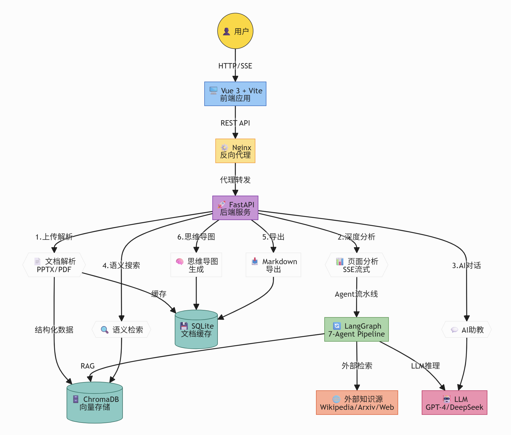
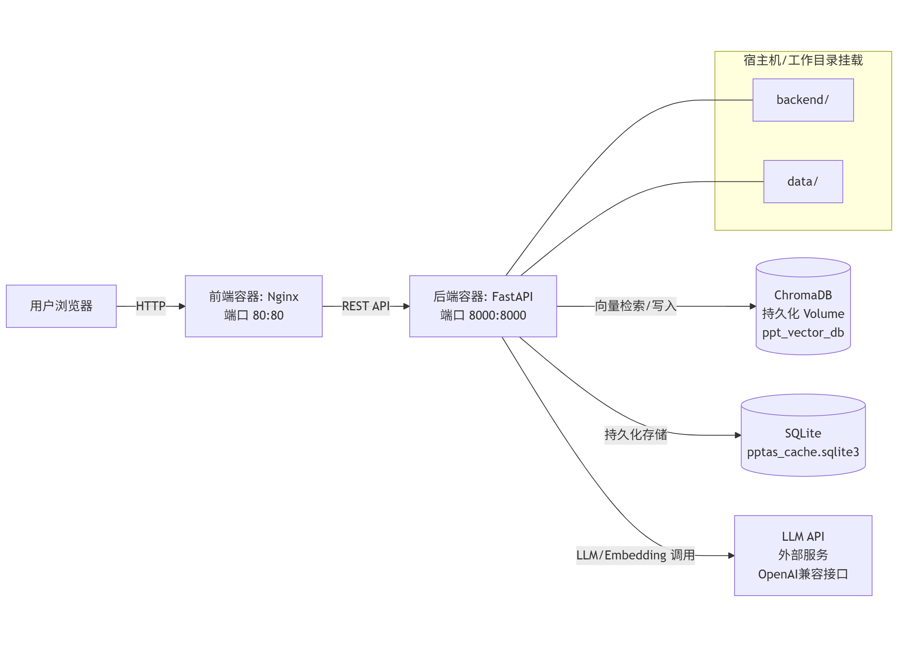
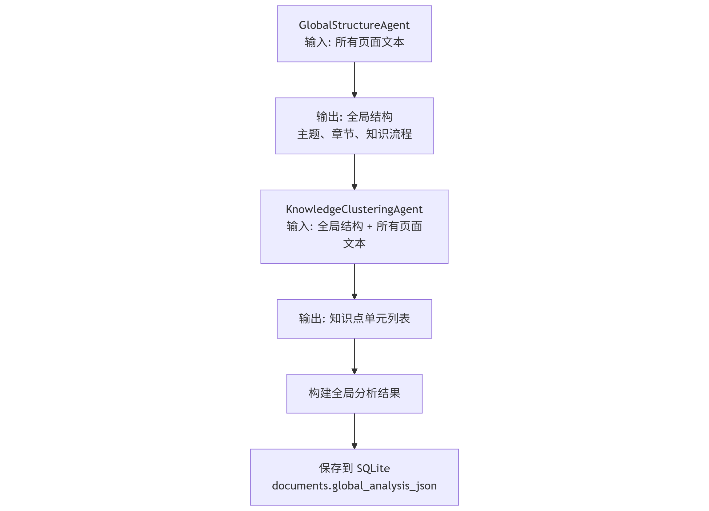
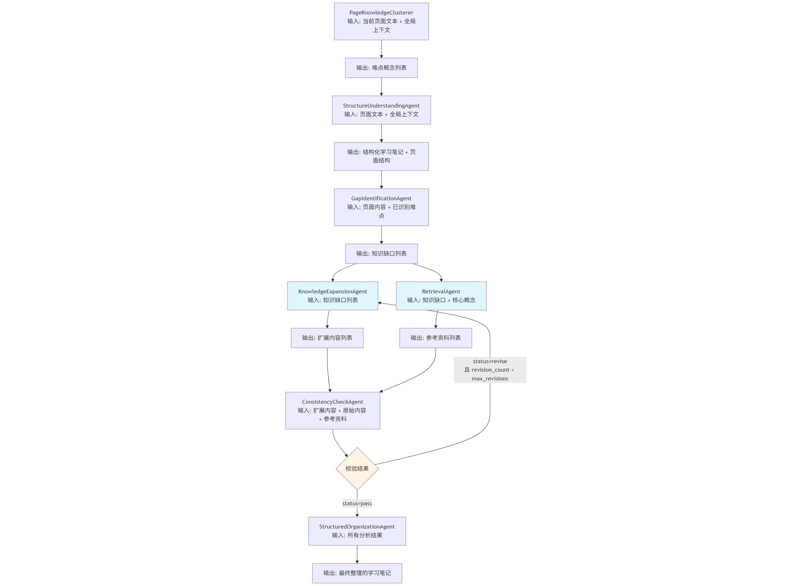
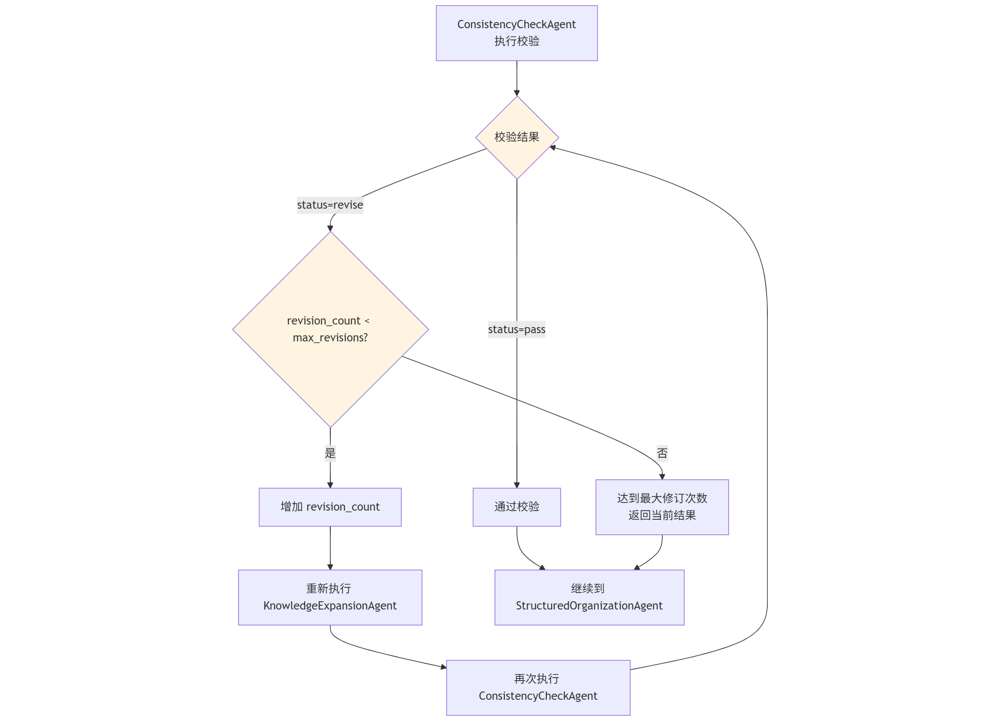
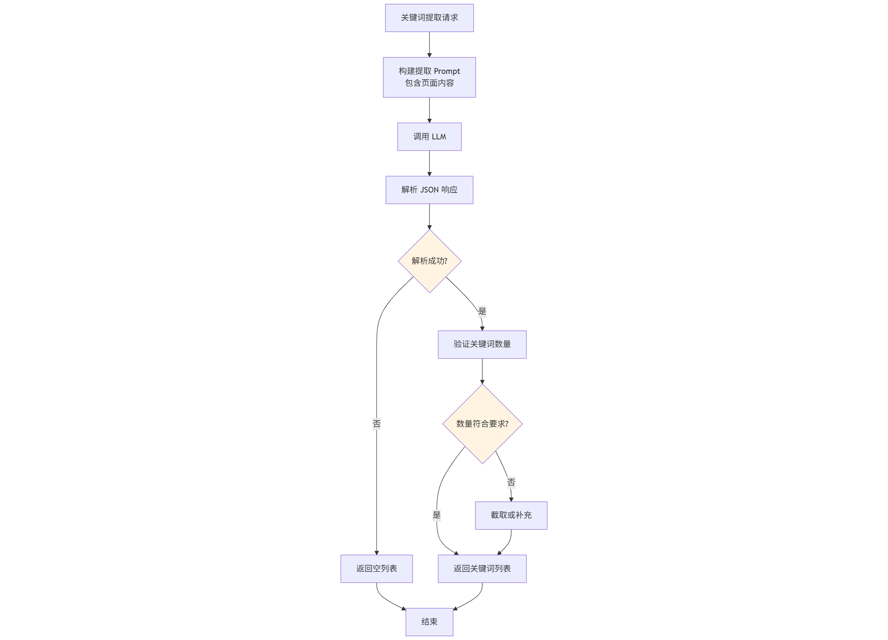
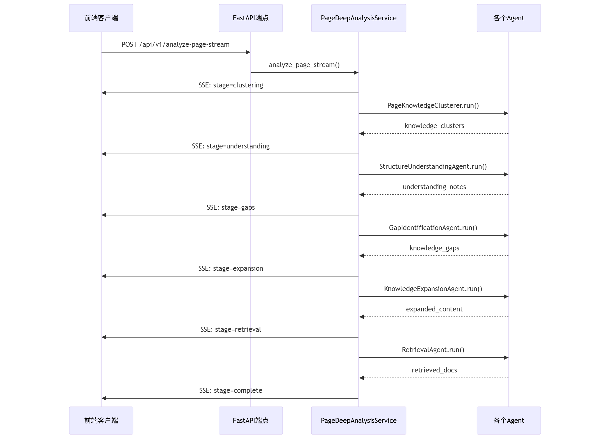
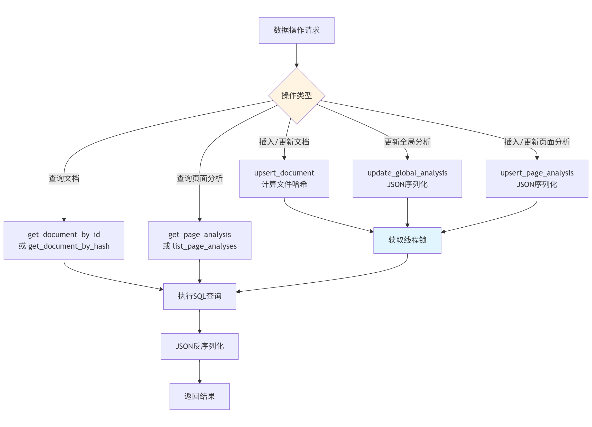

# PPTAS 技术文档

**项目时间**: 2026-01  
**GitHub仓库**: [PPTAS](https://github.com/AM-SuSh/PPTAS)

---

## 一、系统架构设计

### 整体架构概览


PPTAS 采用前后端分离的微服务架构，通过 Docker Compose 实现容器化部署。系统由四个核心组件构成：

- **前端服务**: 基于 Vue.js 3 + Vite 构建的 SPA 应用，通过 Nginx 提供静态资源服务
- **后端服务**: 基于 FastAPI 的异步 Web 框架，提供 RESTful API 和实时流式接口
- **数据持久层**: SQLite 数据库存储文档信息和分析结果
- **向量检索层**: ChromaDB 提供语义检索能力，支持 RAG 增强


**核心组件架构图**:



### 云原生技术栈

#### 容器化部署

**Docker 镜像策略**:
- 后端容器: `python:3.9-slim` 基础镜像，最小化运行时环境
- 前端构建容器: `node:18-alpine` 用于依赖安装和代码编译
- 前端生产容器: `nginx:alpine` 提供高性能静态文件服务

**Docker Compose 编排**:
```yaml
services:
  frontend:
    build: ./frontend
    ports: ["80:80"]
    networks: [pptas-network]
    restart: unless-stopped
    
  backend:
    build: ./backend
    ports: ["8000:8000"]
    volumes: ["./backend:/app"]
    networks: [pptas-network]
    restart: unless-stopped
```

**关键设计**:
- 采用 Bridge 网络驱动创建隔离网络 `pptas-network`
- 通过 Bind Mount 实现后端代码热重载
- 使用 `unless-stopped` 策略确保服务高可用

#### 数据持久化

**Volume 管理策略**:
- SQLite 数据库文件: 宿主机路径映射，支持备份和迁移
- ChromaDB 向量数据: `ppt_vector_db` 目录持久化
- 后端代码目录: Bind Mount 方式挂载，便于开发调试

#### Web 服务框架

**FastAPI + Uvicorn**:
- ASGI 异步服务器，支持高并发请求处理
- 自动生成 OpenAPI 文档 (Swagger UI)
- 内置类型验证和数据序列化
- 启动命令: `uvicorn main:app --host 0.0.0.0 --port 8000`

**Nginx 配置**:
```nginx
server {
    listen 80;
    location / {
        root /usr/share/nginx/html;
        try_files $uri $uri/ /index.html;
    }
    location /api {
        proxy_pass http://backend:8000;
    }
}
```

#### 前端技术栈

- **Vue.js 3**: Composition API 提升代码复用性
- **Vite**: 基于 ESBuild 的快速构建工具，HMR 热更新
- **组件库**: 自定义组件 + Element Plus UI 框架

#### 数据库选型

**SQLite 关系型数据库**:
- 轻量级文件型数据库，零配置部署
- 支持 ACID 事务和 B-tree 索引
- JSON 扩展字段存储复杂数据结构

**ChromaDB 向量数据库**:
- 基于 HNSW 算法的高效向量检索
- 支持自定义 Embedding 模型 (`BAAI/bge-large-zh-v1.5`)
- 内置持久化存储，无需额外配置

#### AI/ML 框架

**LangChain 生态**:
- `langchain-core`: 提供统一的抽象接口
- `langchain-openai`: OpenAI 兼容 API 调用
- `langchain-chroma`: ChromaDB 向量存储集成

**LangGraph 工作流引擎**:
- 有向无环图 (DAG) 结构编排 Agent 流程
- 状态管理和条件分支支持
- 并行任务执行能力

#### 通信协议

**REST API**:
- 标准 HTTP 方法 (GET/POST/DELETE)
- JSON 数据格式
- CORS 跨域支持

**Server-Sent Events (SSE)**:
- 服务器主动推送分析进度
- 单向实时通信
- 自动重连机制

#### 文档处理库

- **python-pptx**: PPTX 文件解析，提取文本和结构
- **PyMuPDF (fitz)**: PDF 文档处理，支持文本和图片提取

---

## 二、核心业务流程

### 文档上传与解析

**实现位置**: `backend/src/services/ppt_parser_service.py`

**支持格式**: PPTX, PDF

**解析流程**:

```
用户上传文件/URL
    ↓
计算文件 SHA256 哈希
    ↓
检查数据库是否已存在 (去重)
    ↓
调用 python-pptx/PyMuPDF 解析
    ↓
提取标题、内容、要点
    ↓
存储到 SQLite (documents 表)
    ↓
文本切片 + 向量化
    ↓
存入 ChromaDB
    ↓
返回 doc_id 和 slides 数据
```

**API 端点**: `POST /api/v1/expand-ppt`

**数据模型**:
```python
{
  "doc_id": "uuid-string",
  "file_name": "example.pptx",
  "slides": [
    {
      "page_id": 1,
      "title": "页面标题",
      "content": "页面文本内容",
      "bullet_points": ["要点1", "要点2"]
    }
  ]
}
```


### 全局分析功能

**目标**: 构建文档的整体知识框架，为单页分析提供上下文

**核心 Agent**:

#### GlobalStructureAgent ：全局结构解析

**职责**: 识别文档主题、章节结构和知识逻辑流

**输入处理**:
- 页数 ≤ 20: 传入完整文本
- 页数 > 20: 智能采样 (前5页 + 后5页 + 中间每5页抽1页)

**Prompt 设计**:
```text
分析整个文档的知识框架，提取:
1. 主题 (main_topic): 核心主题，不能为空或"未知"
2. 章节 (chapters): 包含标题、页码范围、关键概念
3. 知识流 (knowledge_flow): 逻辑递进关系

要求:
- 至少识别 1-3 个主要章节
- 仅返回 JSON，无其他文字
```

**降级策略**:
- JSON 解析失败时，从第一页标题推断主题
- 确保 `main_topic` 字段始终有效

#### KnowledgeClusteringAgent ：知识点聚类

**职责**: 将文档内容聚类为知识点单元

**输入处理**:
- 页数 ≤ 15: 每页前 1000 字
- 页数 > 15: 每页前 500 字摘要

**输出格式**:
```python
[
  {
    "unit_id": "unit_1",
    "title": "知识单元标题",
    "pages": [1, 2, 3],
    "core_concepts": ["概念A", "概念B"]
  }
]
```

**Agent 流程图**:



**API 端点**: `POST /api/v1/analyze-document-global`

**缓存机制**:
- 结果存储在 `documents.global_analysis_json` 字段
- 支持 `force=true` 参数强制重新分析


### 单页深度分析

**实现位置**: `backend/src/services/page_analysis_service.py`

**分析流程图**:



#### Agent 流水线

**1. PageKnowledgeClusterer (页面知识聚类)**

**职责**: 识别页面中学生难以理解的概念

**全局上下文增强**:
```python
if global_analysis:
    prompt += f"""
    文档主题: {main_topic}
    知识流程: {knowledge_flow}
    全局知识单元: {knowledge_units}
    
    请结合全局框架，识别当前页面的难点概念
    """
```

**输出**:
```python
[
  {
    "concept": "概念名称",
    "difficulty_level": 3,  # 1-5
    "why_difficult": "难以理解的原因",
    "related_concepts": ["相关概念"],
    "global_context": "在全局知识体系中的位置"
  }
]
```

**2. StructureUnderstandingAgent (结构理解与笔记生成)**

**职责**: 生成结构化学习笔记

**两次 LLM 调用**:
- 第一次: 生成 Markdown 格式笔记 (温度 0.5)
- 第二次: 提取页面结构信息 (温度 0)

**输入限制**: 页面内容 1000 字 + 全局上下文 800 字

**输出**:
```python
{
  "understanding_notes": "## 标题\n### 要点\n...",
  "page_structure": {
    "page_id": 1,
    "title": "页面标题",
    "core_concepts": ["概念1", "概念2"],
    "key_points": ["要点1", "要点2"]
  }
}
```

**3. GapIdentificationAgent (知识缺口识别)**

**职责**: 识别学生理解障碍点

**缺口类型**:
- 直观解释: 缺乏通俗易懂的说明
- 应用示例: 缺少实际应用场景
- 背景知识: 缺少前置知识铺垫
- 公式推导: 缺少推导过程

**输出**:
```python
[
  {
    "concept": "需要补充的概念",
    "gap_types": ["直观解释", "应用示例"],
    "priority": 4  # 1-5
  }
]
```

**限制**: 最多识别 5 个缺口，避免信息过载

**4. KnowledgeExpansionAgent (知识扩展)**

**职责**: 为知识缺口生成补充说明

**处理策略**:
- 仅处理优先级 ≥ 3 的缺口
- 最多处理前 3 个缺口
- 每个缺口限制 150 字内

**Prompt 模板**:
```text
为缺口生成补充说明:
1. 提供清晰的原理说明
2. 如有公式，给出推导过程
3. 适当提供代码示例 (Python 优先)
4. 提供延伸主题

严格限制:
- 不编造信息
- 不超过 150 字
- 仅返回 JSON
```

**5. RetrievalAgent (外部检索增强)**

**职责**: 从外部知识源检索参考资料

**检索策略**:

```python
# 连接检查优化
def run(self, state):
    # 0. 首先检查外部源可用性
    self._test_sources()
    available_external = any(s["available"] for s in self.sources.values())
    
    if not available_external:
        print("所有外部源不可用，仅使用本地 RAG")
        # 继续执行本地 RAG 检索
```

**知识源**:
- 本地 RAG (ChromaDB): 优先检索
- Wikipedia: 百科知识
- Arxiv: 学术论文
- Baidu Baike: 中文百科

**早期退出**:
- 仅为高优先级缺口 (priority ≥ 4) 检索
- 本地 RAG 结果充足时跳过外部检索
- 所有源不可用时立即返回

**6. ConsistencyCheckAgent (一致性校验)**

**职责**: 校验扩展内容与原始内容的一致性

**校验规则**:
- **禁止编造**: 不能提及 PPT 未涉及的新概念
- **有据可查**: 所有陈述必须来自 PPT 或参考资料
- **标记推测**: 不确定的内容标记为"推测"
- **发现矛盾**: 与 PPT 或参考资料矛盾时标记为修正

**输出**:
```python
{
  "status": "pass" | "revise",
  "issues": ["问题1", "问题2"],
  "suggestions": ["建议1", "建议2"]
}
```

**修订机制**:



- 校验失败 + 修订次数 < max_revisions: 重新扩展
- 校验通过: 进入内容整理阶段

**7. StructuredOrganizationAgent (内容整理)**

**职责**: 整合所有分析结果，生成最终学习笔记

**整理要求**:
- 标题明确，逻辑清晰
- 核心概念优先
- 避免重复原文
- 适合快速复习
- 严格控制长度 (300 字内)


### 语义搜索

**实现位置**: `backend/src/services/vector_store_service.py` - `VectorStoreService`

**功能特性**:
- 基于语义的相似度搜索
- 文档切片向量化存储
- 支持按文件名过滤查询
- 统计信息查询

**技术要点**:
- 使用 ChromaDB 作为向量数据库
- 支持自定义 Embedding 模型（默认：`BAAI/bge-large-zh-v1.5`）
- 文本分块策略：保持幻灯片完整性，每个幻灯片作为一个完整文档存储

**搜索流程**:

```python
def search_similar_slides(
    query: str,
    top_k: int = 10,
    file_name: Optional[str] = None,
    min_score: float = 0.0
) -> List[Dict[str, Any]]:
    """
    语义搜索相似的幻灯片
    
    优化策略:
    1. 使用更宽松的搜索范围（搜索更多结果）
    2. 按页面去重（每个页面只返回一次）
    3. 使用更合理的相似度计算
    4. 如果向量搜索失败，自动降级到关键词搜索
    """
    # 构建过滤条件
    where = {}
    if file_name:
        where["file_name"] = file_name
    
    # 执行向量搜索
    results = vectorstore.similarity_search_with_score(
        query, k=search_k, filter=where
    )
    
    # 去重和排序
    # ...
```

**API 端点**:
- `POST /api/v1/search-semantic`: 语义搜索
- `GET /api/v1/vector-store/stats`: 统计信息
- `GET /api/v1/vector-store/file/{file_name}`: 按文件名搜索
- `DELETE /api/v1/vector-store/file/{file_name}`: 删除文件向量

**请求格式**:
```python
{
  "query": "搜索查询文本",
  "top_k": 10,
  "file_name": "example.pptx",  # 可选
  "file_type": "pptx",           # 可选
  "min_score": 0.0               # 可选
}
```

**响应格式**:
```python
{
  "success": True,
  "query": "搜索查询文本",
  "total_results": 5,
  "results": [
    {
      "content": "幻灯片内容",
      "metadata": {
        "file_name": "example.pptx",
        "page_num": 1,
        "slide_title": "标题",
        "similarity_score": 0.85
      }
    }
  ]
}
```


### 外部资源搜索

**实现位置**: `backend/src/services/external_search_service.py` - `ExternalSearchService`

**功能说明**: 用户主动使用的联网搜索功能，用于搜索 Wikipedia、Arxiv 学术论文和 Web 资源。

**功能特性**:
- 联网搜索多个外部知识源：Wikipedia、Arxiv、Web（DuckDuckGo）
- 支持用户自主选择搜索源
- 并发搜索多个源，提高效率
- 自动检测各搜索源的可用性

**知识源**:
- **Wikipedia**: 百科知识，支持多语言（默认中文）
- **Arxiv**: 学术论文检索，支持按相关性排序
- **Web**: 使用 DuckDuckGo 进行 Web 搜索

**搜索流程**:

```python
class ExternalSearchService:
    """外部资源搜索服务 - 联网搜索 Wikipedia、Arxiv、Web"""
    
    def __init__(self):
        """初始化并检测各搜索源的可用性"""
        # 检测 Wikipedia 库是否安装
        try:
            import wikipedia
            self._wikipedia_available = True
        except ImportError:
            self._wikipedia_available = False
        
        # 检测 Arxiv 库是否安装
        try:
            import arxiv
            self._arxiv_available = True
        except ImportError:
            self._arxiv_available = False
        
        # 检测 DuckDuckGo 库是否安装
        try:
            from duckduckgo_search import DDGS
            self._web_available = True
        except ImportError:
            self._web_available = False
    
    async def search_all(
        self,
        query: str,
        sources: Optional[List[str]] = None,
        max_results_per_source: int = 3
    ) -> ExternalSearchResult:
        """
        综合搜索所有来源
        
        策略:
        1. 如果未指定 sources，默认搜索所有可用源
        2. 并发搜索多个源，提高效率
        3. 合并所有搜索结果
        4. 返回统一格式的结果
        """
        # 并发搜索所有来源
        tasks = []
        if "wikipedia" in sources:
            tasks.append(self.search_wikipedia(query, max_results_per_source))
        if "arxiv" in sources:
            tasks.append(self.search_arxiv(query, max_results_per_source))
        if "web" in sources:
            tasks.append(self.search_web(query, max_results_per_source))
        
        # 等待所有搜索完成
        all_results = await asyncio.gather(*tasks)
        # 合并结果
        # ...
```

**Wikipedia 搜索**:
- 使用 `wikipedia` 库进行搜索
- 支持多语言（默认中文）
- 返回页面标题、URL、摘要

**Arxiv 搜索**:
- 使用 `arxiv` 库进行学术论文检索
- 按相关性排序
- 返回论文标题、URL、摘要、作者、发布日期

**Web 搜索**:
- 使用 `duckduckgo-search` 库进行 Web 搜索
- 返回网页标题、URL、摘要片段

**API 端点**:
- `POST /api/v1/search-external`: 外部资源搜索

**请求格式**:
```python
{
  "query": "搜索查询",
  "sources": ["wikipedia", "arxiv", "web"],  # 可选，指定搜索源
  "max_results": 10                           # 可选，总结果数
}
```

**响应格式**:
```python
{
  "success": True,
  "query": "搜索查询",
  "total_results": 8,
  "sources_used": ["wikipedia", "arxiv", "web"],
  "available_sources": ["wikipedia", "arxiv", "web"],
  "results": [
    {
      "title": "结果标题",
      "url": "https://...",
      "source": "wikipedia",  # 或 "arxiv" 或 "web"
      "snippet": "摘要内容",
      "authors": ["作者1", "作者2"],  # 仅 Arxiv 有
      "published": "2024-01-01"       # 仅 Arxiv 有
    }
  ]
}
```

**依赖要求**:
- `wikipedia`: Wikipedia 搜索库
- `arxiv`: Arxiv 学术论文搜索库
- `duckduckgo-search`: Web 搜索库


---

### 辅助功能


### 关键词提取

**实现**: `backend/src/services/keyword_extraction_service.py`

**流程图**:



**API**: `POST /api/v1/extract-keywords`


### 思维导图生成

**实现**: `backend/src/services/mindmap_service.py`

**API**:
- `POST /api/v1/mindmap`: 单页思维导图
- `POST /api/v1/mindmap/from-slides`: 整个 PPT 思维导图
- `POST /api/v1/mindmap/from-global-analysis`: 基于全局分析的思维导图

#### 分析结果导出

**实现**: `backend/src/services/export_service.py`

**导出内容**:
- 文档基本信息
- 全局分析结果 (主题、章节、知识点单元)
- 页面分析结果 (学习笔记、知识缺口、补充说明、参考资料)

**API**: `POST /api/v1/export`


### 流式分析实现

**流程图**:



**SSE 事件流**:

```python
async def event_generator():
    # 阶段1: 知识聚类
    yield f"data: {json.dumps({
        'stage': 'clustering',
        'data': knowledge_clusters,
        'message': '正在识别难点概念...'
    })}\n\n"
    
    # 阶段2: 学习笔记
    yield f"data: {json.dumps({
        'stage': 'understanding',
        'data': understanding_notes,
        'message': '正在生成学习笔记...'
    })}\n\n"
    
    # 阶段3-7: 缺口识别、扩展、检索、校验、整理
    # ...
    
    # 完成
    yield f"data: {json.dumps({
        'stage': 'complete',
        'data': final_result,
        'message': '分析完成'
    })}\n\n"
```

**API 端点**: `POST /api/v1/analyze-page-stream`

**前端消费**:
```javascript
const eventSource = new EventSource('/api/v1/analyze-page-stream');
eventSource.onmessage = (event) => {
  const { stage, data, message } = JSON.parse(event.data);
  updateUI(stage, data, message);
};
```


### AI 助教对话

**实现位置**: `backend/src/services/ai_tutor_service.py`

**功能特性**:
- 多页面独立对话历史
- 基于页面分析结果的上下文
- 聚焦学生理解障碍点

**系统 Prompt 模板**:

```text
你是一位耐心的 AI 学习助教，帮助学生理解和掌握知识。

【页面标题】: {title}
【原始内容】: {content}
【学生学习笔记】: {understanding_notes}
【知识要点分析】: {concepts_analysis}
【可能的理解障碍】: {gaps_info}
【补充说明】: {expanded_content}

【教学风格】:
1. 以学生为中心 - 始终考虑学生的理解水平
2. 明确重点 - 突出最重要的概念和易错点
3. 循序渐进 - 从简单到复杂，从具体到抽象
4. 举例说明 - 提供实际例子或类比帮助理解
5. 互动式 - 引导而不是直接给出答案

【禁止】:
- 不编造信息
- 不离开当前页面的范围
- 不忽视学生的理解困难
```

**API 端点**:
- `POST /api/v1/chat`: 发送消息
- `POST /api/v1/tutor/set-context`: 设置页面上下文
- `GET /api/v1/tutor/conversation`: 获取对话历史
- `DELETE /api/v1/tutor/conversation/{page_id}`: 清除对话

---

## 三、数据持久化设计

### 数据库架构

**选型理由**:
- SQLite: 轻量级、零配置、文件型数据库
- ChromaDB: 内置向量检索、支持自定义 Embedding

### SQLite 表结构

**documents 表**:

```sql
CREATE TABLE documents (
    doc_id TEXT PRIMARY KEY,              -- UUID 主键
    file_name TEXT,                       -- 文件名
    file_type TEXT,                       -- 文件类型 (pptx/pdf)
    file_hash TEXT UNIQUE,                -- SHA256 哈希值
    slides_json TEXT,                     -- 页面数据 (JSON)
    global_analysis_json TEXT,            -- 全局分析结果 (JSON)
    created_at TEXT,                      -- 创建时间
    updated_at TEXT                       -- 更新时间
)
```

**page_analysis 表**:

```sql
CREATE TABLE page_analysis (
    doc_id TEXT NOT NULL,                 -- 文档 ID (外键)
    page_id INTEGER NOT NULL,             -- 页面编号
    analysis_json TEXT NOT NULL,          -- 分析结果 (JSON)
    created_at TEXT,
    updated_at TEXT,
    PRIMARY KEY (doc_id, page_id),
    FOREIGN KEY (doc_id) REFERENCES documents(doc_id) ON DELETE CASCADE
)
```

**索引优化**:
- `idx_documents_file_hash`: 加速文件去重查询
- `idx_page_analysis_doc_id`: 加速文档页面分析查询

### 数据操作流程

**流程图**:



**服务实现**: `backend/src/services/persistence_service.py`

**核心方法**:
- `upsert_document()`: 插入或更新文档
- `update_global_analysis()`: 更新全局分析结果
- `upsert_page_analysis()`: 插入或更新页面分析
- `get_document_by_id()`: 通过 doc_id 查询
- `get_document_by_hash()`: 通过 file_hash 查询 (去重)

**线程安全**:

```python
class PersistenceService:
    def __init__(self, db_path: str):
        self._lock = threading.Lock()
    
    def upsert_document(self, ...):
        with self._lock:
            with self._connect() as conn:
                # 数据库操作
                conn.commit()
```

**JSON 序列化**:

```python
# 存储
slides_json = json.dumps(slides, ensure_ascii=False)
conn.execute("INSERT INTO documents (slides_json) VALUES (?)", (slides_json,))

# 读取
doc = dict(row)
doc["slides"] = json.loads(doc["slides_json"]) if doc.get("slides_json") else []
```

### 向量存储

**实现**: `backend/src/services/vector_store_service.py`

**功能**:
- 文档切片向量化存储
- 基于语义的相似度搜索
- 支持按文件名过滤查询

**Embedding 模型**: `BAAI/bge-large-zh-v1.5`

**API**:
- `POST /api/v1/search-semantic`: 语义搜索
- `GET /api/v1/vector-store/stats`: 统计信息
- `GET /api/v1/vector-store/file/{file_name}`: 按文件名搜索
- `DELETE /api/v1/vector-store/file/{file_name}`: 删除文件向量

---

## 四、LLM Agent 流水线

### 状态管理

**GraphState 定义** (`backend/src/agents/models.py`):

```python
class GraphState(TypedDict):
    # 全局输入
    ppt_texts: List[str]                    # PPT 文本列表
    global_outline: Dict[str, Any]          # 全局概览
    knowledge_units: List[KnowledgeUnit]   # 知识点单元
    
    # 当前处理单元
    current_unit_id: str                    # 当前单元 ID
    current_page_id: int                    # 当前页面 ID
    raw_text: str                           # 原始文本
    
    # Agent 输出
    page_structure: Dict[str, Any]          # 页面结构
    knowledge_clusters: List[Dict]          # 知识聚类
    understanding_notes: str                # 理解笔记
    knowledge_gaps: List[KnowledgeGap]      # 知识缺口
    expanded_content: List[ExpandedContent] # 扩展内容
    retrieved_docs: List[Document]          # 检索文档
    check_result: CheckResult               # 校验结果
    final_notes: str                        # 最终笔记
    
    # 控制字段
    revision_count: int                     # 修订次数
    max_revisions: int                      # 最大修订次数
```

### 流水线架构

**LangGraph 工作流构建**:

```python
workflow = StateGraph(GraphState)

# 添加节点
workflow.add_node("global_structure", global_structure_agent.run)
workflow.add_node("knowledge_clustering", clustering_agent.run)
workflow.add_node("structure_understanding", structure_agent.run)
workflow.add_node("gap_identification", gap_agent.run)
workflow.add_node("knowledge_expansion", expansion_agent.run)
workflow.add_node("retrieval", retrieval_agent.run)
workflow.add_node("consistency_check", check_agent.run)
workflow.add_node("structured_organization", organization_agent.run)

# 定义边
workflow.set_entry_point("global_structure")
workflow.add_edge("global_structure", "knowledge_clustering")
workflow.add_edge("knowledge_clustering", "structure_understanding")
workflow.add_edge("structure_understanding", "gap_identification")
workflow.add_edge("gap_identification", "knowledge_expansion")
workflow.add_edge("gap_identification", "retrieval")  # 并行
workflow.add_edge("knowledge_expansion", "consistency_check")
workflow.add_edge("retrieval", "consistency_check")

# 条件边: 校验通过 -> 整理，校验失败 -> 重新扩展
workflow.add_conditional_edges(
    "consistency_check",
    should_revise,
    {
        "revise": "knowledge_expansion",
        "pass": "structured_organization"
    }
)

workflow.add_edge("structured_organization", END)
```

**执行流程**:

```
初始状态 (GraphState)
  ↓
GlobalStructureAgent → 全局结构 (主题、章节、知识流)
  ↓
KnowledgeClusteringAgent → 知识点单元
  ↓
PageKnowledgeClusterer → 难点概念
  ↓
StructureUnderstandingAgent → 学习笔记 + 页面结构
  ↓
GapIdentificationAgent → 知识缺口
  ↓
┌─────────────────┬─────────────────┐
│ KnowledgeExpansionAgent │ RetrievalAgent │ (并行)
│ 扩展内容         │ 参考资料        │
└─────────────────┴─────────────────┘
  ↓
ConsistencyCheckAgent → 一致性校验
  ↓
[条件判断: 是否需要修订]
  ├─→ 需要修订 → KnowledgeExpansionAgent (重新扩展)
  └─→ 通过 → StructuredOrganizationAgent (内容整理)
  ↓
最终状态 (包含所有分析结果)
```

### Prompt 工程策略

#### 结构化输出优先

**所有关键链路要求 "仅输出 JSON"**:

```python
# 示例: GlobalStructureAgent
prompt = """
请以 JSON 格式输出，格式如下:
{
  "main_topic": "文档的核心主题(必须填写，不能为空)",
  "chapters": [...],
  "knowledge_flow": "..."
}

重要要求:
- main_topic 必须填写，不能为空或"未知"
- 至少识别 1-3 个主要章节
- 只返回 JSON，不要其他文字说明
"""
```

#### 约束与护栏

**全局结构解析**:
- `main_topic` 必须填写，不能为空或"未知"
- 至少识别 1-3 个主要章节

**知识缺口识别**:
- 最多 5 个缺口，避免过度分析

**知识扩展**:
- 最多处理 3 个高优先级缺口
- 每个缺口限制 150 字内

**一致性校验**:
- 禁止编造信息
- 所有陈述必须来自 PPT 或参考资料
- 标记推测和修正

#### 降级策略

**示例: GlobalStructureAgent**:

```python
try:
    result = json.loads(content)
except Exception as e:
    print(f"JSON 解析失败: {e}")
    # 从第一页标题推断主题
    result = {"main_topic": "未知", "chapters": [], "knowledge_flow": ""}
    if ppt_texts and len(ppt_texts) > 0:
        first_page = ppt_texts[0]
        if "标题:" in first_page:
            inferred_topic = first_page.split("标题:")[1].split("\n")[0].strip()
            if inferred_topic:
                result["main_topic"] = inferred_topic
```

#### 温度参数配置

| Agent | 温度 | 说明 |
|-------|------|------|
| GlobalStructureAgent | 0.0 | 确定性，稳定输出 |
| KnowledgeClusteringAgent | 0.0 | 确定性，稳定输出 |
| PageKnowledgeClusterer | 0.3 | 有创意但相对稳定 |
| StructureUnderstandingAgent | 0.5 | 平衡创意和准确性 |
| GapIdentificationAgent | 0.2 | 确定性，聚焦实际问题 |
| KnowledgeExpansionAgent | 0.6 | 更多创意用于举例 |
| ConsistencyCheckAgent | 0.0 | 确定性，严格校验 |
| StructuredOrganizationAgent | 0.5 | 平衡创意和准确性 |

### LLM 工具链

**接入方式**: LangChain OpenAI SDK 兼容接口

**配置**: `backend/src/agents/base.py`

```python
class LLMConfig:
    api_key: str
    base_url: str
    model: str
    temperature: float = 0.7
    max_retries: int = 3
```

**重试机制**: 最多重试 3 次

**幻觉风险控制**:
- 一致性校验 Agent 校验扩展内容与原始内容的一致性
- 禁止编造信息
- 所有陈述必须来自 PPT 或参考资料

---

## 五、性能优化

### 缓存策略

**分析结果缓存**:
- 全局分析结果缓存在 `documents.global_analysis_json`
- 单页分析结果缓存在 `page_analysis.analysis_json`
- 支持 `force=true` 参数强制重新分析

**缓存失效**:
- 删除文档时级联删除分析结果

### 文本处理优化

**全局分析摘要策略**:
- 页数 ≤ 20: 传入完整文本
- 页数 > 20: 取前 5 页、后 5 页，中间每 5 页取 1 页，每页限制 500 字符

**单页分析输入限制**:
- 页面内容: 1000-1500 字
- 全局上下文: 800 字
- 检索查询: 800 字

### 流式输出

**优势**:
- 用户无需等待所有分析完成
- 可以提前查看部分结果
- 实时反馈分析进度

**实现**: Server-Sent Events (SSE) 协议

### 并行处理

**策略**:
- 知识扩展和外部检索可并行执行
- 多页面分析支持批处理

### 网络请求优化

**源可用性缓存**:
- 初始化时测试一次外部源连通性
- 如果所有源不可用，立即跳过检索

**早期退出策略**:
- 仅为高优先级缺口 (priority ≥ 4) 检索
- 本地 RAG 足够时跳过外部检索
- 获得足够结果后停止查询

**结果过滤**:
- 去除占位符文档 ("未找到...")
- 仅保留有有效 URL 的结果
- 去重处理

---

## 六、配置管理

### 配置文件结构

**位置**: `backend/config.json`

```json
{
  "llm": {
    "api_key": "your-api-key",
    "base_url": "https://api.openai.com/v1",
    "model": "gpt-4"
  },
  "retrieval": {
    "preferred_sources": ["arxiv", "wikipedia"],
    "max_results": 3,
    "local_rag_priority": true
  },
  "expansion": {
    "max_revisions": 2,
    "min_gap_priority": 3,
    "temperature": 0.7
  },
  "streaming": {
    "enabled": true,
    "chunk_size": 50
  },
  "vector_store": {
    "path": "./ppt_vector_db",
    "embedding_model": "BAAI/bge-m3"
  }
}
```

### 配置加载优先级

1. **环境变量** (最高优先级)
   - `OPENAI_API_KEY` → `llm.api_key`
   - `OPENAI_BASE_URL` → `llm.base_url`
   - `OPENAI_MODEL` → `llm.model`

2. **配置文件**
   - `backend/config.json`
   - `src/config.json`
   - 当前工作目录的 `config.json`

3. **默认值** (最低优先级)

### 配置查找流程

```python
def load_config():
    """加载配置文件"""
    config_path = os.path.join(os.path.dirname(__file__), "..", "..", "config.json")
    
    if not os.path.exists(config_path):
        config_path = os.path.join(os.path.dirname(__file__), "..", "config.json")
    
    if os.path.exists(config_path):
        with open(config_path, "r", encoding="utf-8") as f:
            return json.load(f)
    
    # 默认配置
    return {
        "llm": {
            "api_key": os.getenv("api_key", ""),
            "base_url": os.getenv("base_url", "https://api.openai.com/v1"),
            "model": os.getenv("model", "gpt-4")
        }
    }
```

---

## 七、错误处理

### Agent 级别异常处理

**策略**: 每个 Agent 的 `run()` 方法都包含 try-except 块

```python
try:
    state = self.agent.run(state)
except Exception as e:
    print(f"Agent 执行失败: {e}")
    # 返回默认值，不中断流程
    state["result"] = []
```

### API 级别异常处理

**FastAPI 异常机制**:

```python
try:
    result = service.analyze_page(...)
    return {"success": True, "data": result}
except HTTPException:
    raise
except Exception as e:
    raise HTTPException(status_code=500, detail=f"分析失败: {str(e)}")
```

### 日志记录

**日志级别**:
- INFO: 正常流程信息
- WARNING: 警告信息 (如缓存未命中)
- ERROR: 错误信息 (如 Agent 执行失败)

**日志内容**:
- Agent 执行开始和结束
- LLM 调用信息 (发送的文本长度、返回的原始内容)
- 缓存命中情况
- 错误堆栈信息

**示例**:
```python
print(f" 发送给 LLM 的文本长度: {len(ppt_summary)} 字符")
print(f" LLM 返回的原始内容: {response.content[:500]}...")
print(f" 解析成功: 主题={result.get('main_topic', '未知')}, 章节数={len(result.get('chapters', []))}")
print(f" JSON 解析失败: {e}")
```

---

## 八、API 接口总览

### 文档相关

- `POST /api/v1/expand-ppt`: 上传并解析 PPT/PDF 文档
- `GET /api/v1/document/by-name/{file_name}`: 按文件名查询文档

### 分析相关

- `POST /api/v1/analyze-document-global`: 全局分析
- `POST /api/v1/analyze-page`: 单页分析 (非流式)
- `POST /api/v1/analyze-page-stream`: 单页分析 (流式)
- `GET /api/v1/page-analysis`: 查询单页分析
- `GET /api/v1/page-analysis/all`: 查询所有页面分析

### 搜索相关

- `POST /api/v1/search-semantic`: 语义搜索
- `POST /api/v1/search-references`: 参考文献搜索
- `POST /api/v1/search-external`: 外部资源搜索
- `POST /api/v1/search-by-concepts`: 按概念搜索

### 向量存储相关

- `GET /api/v1/vector-store/stats`: 统计信息
- `GET /api/v1/vector-store/file/{file_name}`: 按文件名搜索
- `DELETE /api/v1/vector-store/file/{file_name}`: 删除文件向量

### AI 助教相关

- `POST /api/v1/chat`: 发送消息
- `POST /api/v1/tutor/set-context`: 设置页面上下文
- `POST /api/v1/tutor/set-context-bulk`: 批量设置上下文
- `GET /api/v1/tutor/conversation`: 获取对话历史
- `DELETE /api/v1/tutor/conversation/{page_id}`: 清除对话历史

### 辅助功能

- `POST /api/v1/mindmap`: 单页思维导图
- `POST /api/v1/mindmap/from-slides`: 整个 PPT 思维导图
- `POST /api/v1/mindmap/from-global-analysis`: 基于全局分析的思维导图
- `POST /api/v1/export`: 导出分析结果
- `POST /api/v1/extract-keywords`: 提取关键词
- `GET /api/v1/health`: 健康检查
- `GET /api/v1/health/complete`: 完整健康检查
- `GET /api/v1/health/llm`: LLM 健康检查

---

## 九、系统优势与改进方向

### 系统优势

**云原生架构**:
- 容器化部署，环境一致性高
- 职责拆分清晰，易于维护和扩展
- 符合"计算与数据服务分离"的工程实践

**稳定性设计**:
- 幻觉风险显式对抗 (一致性校验 Agent)
- 校验与可审计 (输出 status/issues/suggestions)
- 重试与降级 (LLM 调用失败具备重试，JSON 解析失败时降级返回)
- 连接检查优化 (外部检索在 AI 答复之前进行连接检查)

**扩展性**:
- 配置开关与可插拔 (LLM 配置、检索配置、扩展配置等集中在 `config.json`)
- Agent 可扩展 (独立 Agent 类封装，可新增更多 Agent)
- 部署可演进 (当前为 Docker Compose，后续可演进至 K8S)

**Prompt 工程严谨性**:
- 结构化输出优先 (要求"仅输出 JSON")
- 全局上下文支持 (单页分析可以基于全局分析结果)
- CoT 使用方式克制 (输出严格约束为 JSON)

### 改进方向

**分布式部署**:
- 支持多实例部署，提高并发处理能力

**更多知识源**:
- 集成更多外部知识源，提供更丰富的参考资料

**模型微调**:
- 针对特定领域微调模型，提高分析准确性

**用户反馈**:
- 收集用户反馈，持续优化分析质量

**性能监控**:
- 添加性能监控和指标收集

---

## 附录：关键实现文件索引

### 部署与配置
- 部署编排: `docker-compose.yml`
- 后端配置: `backend/src/app.py` - `load_config()`
- LLM 配置: `backend/src/agents/base.py` - `LLMConfig`

### 文档处理
- PPT 解析: `backend/src/services/ppt_parser_service.py` - `DocumentParserService`
- 向量存储: `backend/src/services/vector_store_service.py` - `VectorStoreService`

### 全局分析
- 全局结构 Agent: `backend/src/agents/base.py` - `GlobalStructureAgent`
- 知识聚类 Agent: `backend/src/agents/base.py` - `KnowledgeClusteringAgent`

### 单页分析
- 分析服务: `backend/src/services/page_analysis_service.py` - `PageDeepAnalysisService`
- 页面知识聚类: `backend/src/services/page_analysis_service.py` - `PageKnowledgeClusterer`
- 结构理解: `backend/src/agents/base.py` - `StructureUnderstandingAgent`
- 缺口识别: `backend/src/agents/base.py` - `GapIdentificationAgent`
- 知识扩展: `backend/src/agents/base.py` - `KnowledgeExpansionAgent`
- 外部检索: `backend/src/agents/base.py` - `RetrievalAgent`
- 一致性校验: `backend/src/agents/base.py` - `ConsistencyCheckAgent`
- 内容整理: `backend/src/agents/base.py` - `StructuredOrganizationAgent`

### 辅助功能
- 外部知识源: `backend/src/services/mcp_tools.py` - `MCPRouter`
- AI 助教: `backend/src/services/ai_tutor_service.py` - `AITutorService`
- 思维导图: `backend/src/services/mindmap_service.py` - `MindmapService`
- 结果导出: `backend/src/services/export_service.py` - `ExportService`
- 关键词提取: `backend/src/services/keyword_extraction_service.py` - `KeywordExtractionService`

### 数据与模型
- 持久化服务: `backend/src/services/persistence_service.py` - `PersistenceService`
- 数据模型: `backend/src/agents/models.py`
- API 端点：`backend/src/app.py`  

---
